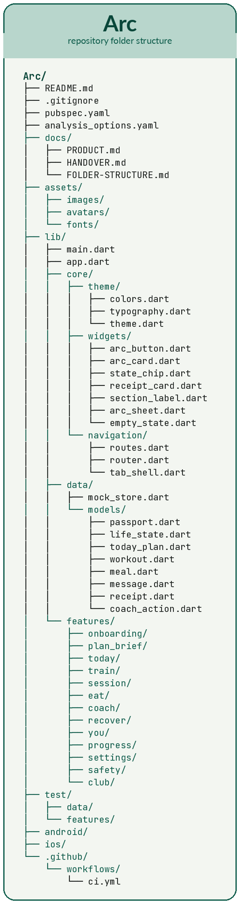

# Arc
Arc — India-first AI health &amp; fitness coach. Manages train, eat, and recover as life changes. Persistent Passport + life states. The coach that does not restart when your life does.
## Team split

Four people. Folders are ownership. Do not edit someone else's feature folder without asking.

Shared files (Person 1 owns them, everyone else reads):

- `lib/data/mock_store.dart`
- `lib/core/theme/`
- `lib/core/navigation/tab_shell.dart`

### Person 1 — Foundation

**Owns:** `lib/core/` · `lib/data/` · `lib/app.dart` · `lib/main.dart`

- Theme: colors, type, buttons, cards, chips, sheets
- Router + tabs: Today · Train · Eat · Coach · You
- Models + `mock_store.dart` (Saarthak seed)
- `apply(CoachAction)` so a Coach tap can change Today

**Done when:** app opens on tabs, Saarthak lives in one store, empty screens load.

**Do not:** build live session or Eat meals.

### Person 2 — Train + Recover

**Owns:** `lib/features/train/` · `session/` · `recover/`

- Week strip, session detail, swap, home vs gym
- Live session: sets, RPE, rest, abort
- Missed session = absorbed, not failed
- Recover: readiness, sleep, body region, 0–10
- Surgery-prep = low impact. Not a medical module.

**Done when:** start and finish a workout; miss a day with no shame copy.

**Do not:** touch Coach chat or Eat.

### Person 3 — Coach + Eat + Safety

**Owns:** `lib/features/coach/` · `eat/` · `safety/`

- Coach thread + chips: Tired, Travel, Pain, Missed, budget, meal
- Every chip calls `apply()` and shows a receipt
- Eat: guidance-first Indian plates, log `2 dosa + sambar`
- Pain sheet + red-flag screen (no workout on that screen)

**Done when:** “Travelling tomorrow” changes WhyToday + chips, not only a chat bubble.

**Do not:** restyle onboarding. Do not act like a doctor.

### Person 4 — You + Club + Docs

**Owns:** `lib/features/you/` · `progress/` · `settings/` · `club/` · `docs/` · `README.md`

- Passport (living “We’ve got you”)
- Progress: week / 8 weeks, no 20 rings
- Settings: diet toggle, EN/HI/TA mock, Soon rows
- Gamify: XP, freeze streak, Trainer / Chef / Doc, 3 quests
- README, folder-structure image, handover in `docs/`

**Done when:** Travel freezes the streak and still grants +12 XP.

**Do not:** change Train programming or Coach mutation logic.

### First week

| Day | Who | Output |
|---|---|---|
| 1 | Person 1 | Tabs + store + theme |
| 2–3 | Person 2 + 3 | Train week or Coach travel chip |
| 4 | Person 3 | Eat three plates + meal log |
| 5 | Person 4 | Passport + README structure |
| 6 | Person 4 | XP / streak freeze on travel |

### Branches

## Folder structure

