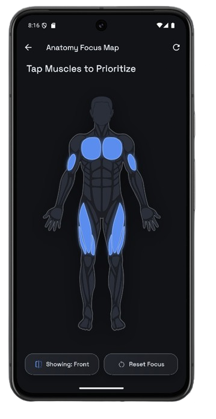
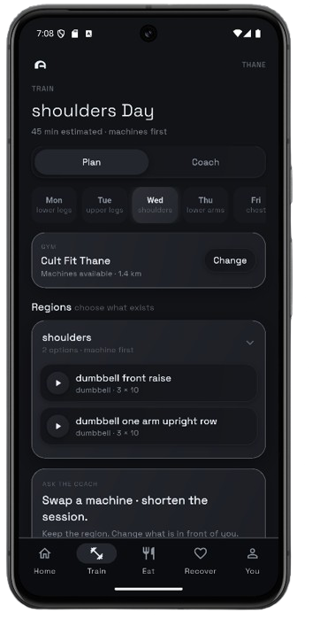
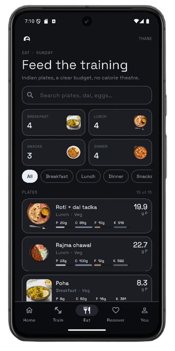
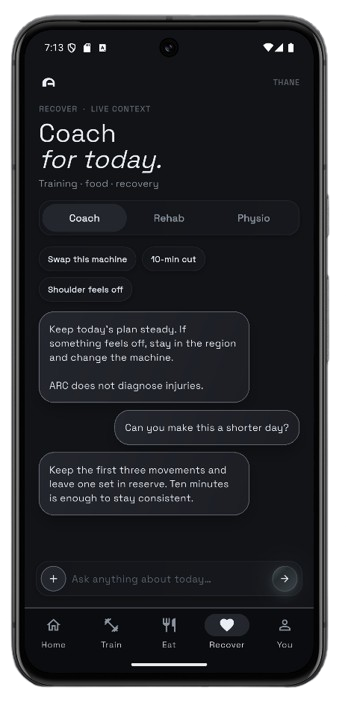

# Arc

India-first health and fitness coach. One app for train, eat, and recover.

The user chooses what to train. Arc builds the path, then keeps it when the week changes: a sore shoulder, a travel day, a ₹200 food budget, a new goal.

## Why Arc

Gym is cheap. A trainer plus a nutrition plan is not. Most apps assume a healthy week and go quiet when that week ends. Arc keeps one passport across train, eat, and recovery, and changes tomorrow’s plan without a new subscription.

Built for someone in India who wants a physique or a habit. Veg, egg, or non-veg. A daily budget in rupees. A gym they may not know the kit of, or a session at home.

## Features

**Today, on one screen.** Workout, plate, and recovery. Home workouts, the full exercise library, and a trainer for doubts.

**Train.** A day is a muscle pair, such as Chest and Biceps. Regions open into exercises on different machines, with a name and a demo, because the gym kit is unknown. No kit: the same muscles, at home.

**Eat.** Indian plates, not an imported calorie list. Protein and rupees lead. Breakfast, lunch, snack, dinner. Allergies are asked before a plate is suggested.

**Recover.** Yoga, rehab, and a verified physio. Rehab is a reported limit, not a diagnosis. Arc adjusts training around it. A physio is the escalation.

**Personal trainer.** One place to say what changed. Sore, travel, or budget. The plan updates.

**You.** Body, budget, diet, reminders. The record stays with the person, not with a single good week.

## Onboarding

Seven questions, then Home.

1. Goal. Build muscle, lose fat, stay consistent.
2. Sex.
3. Age.
4. Height and weight.
5. Level. Beginner, intermediate, advanced.
6. Days you can train. 3, 4, 5, 6.
7. Food allergies. Dairy, gluten, nuts, eggs, none.

Train, Eat, and Yoga ask their own depth the first time those sections open. Home does not.

## Stack

- Flutter
- Supabase. Auth, Postgres, Storage
- Indian food data from IFCT / INDB. Ingredients per 100 g, plates summed from ingredients

## Run

Flutter and an Android emulator already installed.

git pull
flutter pub get
flutter emulators --launch Pixel_8
flutter run

Put the anon public key in lib/data/supabase_config.dart. Never the service role key. Sign up with email. Confirm-email is off for the demo.

## Team

Saarthak Kulkarni, and the Arc project team.

Arc does not diagnose, grade an injury, or prescribe.
