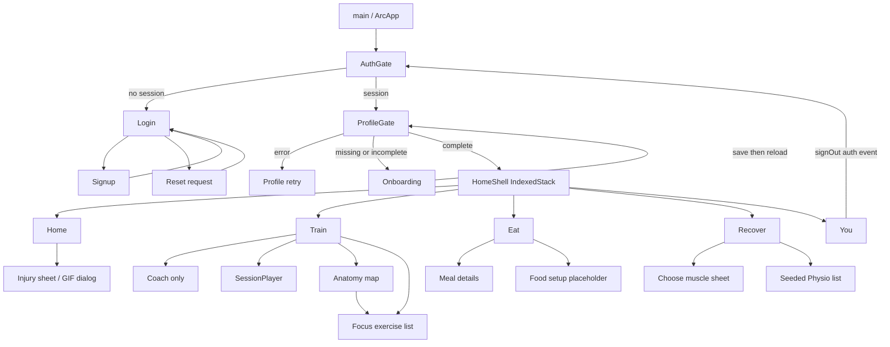
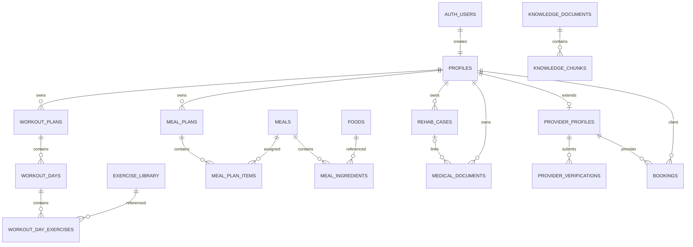

# ARC Current State Audit

Audit date: **9 October 2026 (Asia/Calcutta)**  
Repository: **C:/Users/ivang/ARC VSCODE/Arc**  
Linked Supabase project: **nbojicqbpqgotdmdayku**  
Scope: read-only source, configuration, schema, policy, and safe-check audit. This report is the only intentional repository write.

Evidence labels:

- **VERIFIED**: directly observed source contents, filesystem/check output, or live connector metadata. This label does not imply device runtime verification.
- **CODE-INFERRED**: expected behavior or failure derived from actual code paths, without executing the user journey.
- **UNVERIFIED**: inaccessible, not exercised, or dependent on settings/device/service state not inspected.

No signups, logins, password resets, database mutations, migrations, backend POST requests, storage downloads, or application-record queries were performed. Environment values, passwords, tokens, private user data, and recover_store.json contents were not read. Public connector project metadata was used only to identify the linked project. No features were implemented.

## 1. Executive Summary

ARC is a Flutter mobile application with email/password Supabase authentication, a profile-gated onboarding flow, five main tabs, an exercise viewer/session interface, a Supabase meal catalog, and two separate Python backend implementations. It is currently a mixture of connected catalog/auth functionality and presentation prototypes.

**VERIFIED:** 45 Dart source files under lib contain 9,565 lines; 43 Python files were syntax-checked. The configured Flutter URL matches the actual connected project. The live public schema has **17 application tables and one view**. All 17 tables have RLS enabled, but that does not establish safe access through the backend or the view.

The most consequential findings:

1. **CODE-INFERRED, critical:** Coach accepts a caller-supplied user_id without authenticating a Supabase session. Its tools can read profiles/plans and write profiles.user_state. If SUPABASE_KEY is privileged, this creates a cross-account access/write path. The key's privilege and actual deployment exposure are **UNVERIFIED**; the missing authentication is verified source evidence.
2. **VERIFIED metadata, high:** meal_nutrition is a postgres-owned view without security_invoker, with client SELECT grants and no is_published filter. Supabase's security advisor flags it as an ERROR. The catalog can therefore bypass the publication boundary enforced on the base tables; no unpublished records were retrieved to demonstrate this.
3. **CODE-INFERRED, high:** dark ThemeData uses GoogleFonts.spaceGroteskTextTheme() without a dark base. Installed google_fonts 6.3.3 defaults that helper to ThemeData.light().textTheme. Inherited text on dark surfaces can be dark-on-dark, particularly generic detail/setup pages. This is not a screenshot-confirmed finding.
4. Training uses an arbitrary first user plan, ignores stored exercise ordering/rest in its runtime models, hardcodes three sets and a 60-second rest, and never persists completion. “Use 10-minute version” starts the same full session.
5. Recover's “recorded” conversation and injury status are local only. They neither write rehab_cases nor call RecoverApi.send(). Attachment selection merely toggles a filename. Actual Train sessions do not respect that injury state.
6. Home has a real profile name but fixed training/meals/macros. You is a fixed demo identity and body placeholder. Eat is a real catalog, not meal tracking or a personalized plan.
7. Live schema differs from repository migrations; the connector lists no migration history. The current auth trigger does propagate display_name at creation, but does not synchronize later changes.
8. **VERIFIED checks:** flutter analyze --no-pub exits 1 with 102 issues (15 warnings, 87 infos, no reported errors). Two safe Python scripts fail due to a missing fixture. No Flutter test directory exists. No device journey was run.

These issues can be addressed incrementally within Flutter + Supabase. No complete rewrite is indicated.

## 2. Repository Architecture

### Structure and boundaries (VERIFIED)

| Path | Responsibility / current condition |
| --- | --- |
| lib/main.dart | Supabase initialization, ArcApp, AuthGate root, HomeShell with five-tab IndexedStack |
| lib/auth/ | Login, signup, reset-request, onboarding, profile/auth gate |
| lib/data/ | Supabase auth/profile/workout/meal/storage services; device health/location services; enums and models |
| lib/data/models/ | Food, Meal, MealIngredient, MealNutrition, MealPlan, MealPlanItem; nutrition.dart exports |
| lib/features/eat/ | MealDetailPage, placeholder EatSetupPage, empty widgets/meal_card.dart |
| lib/*.dart | Large top-level screen files, Coach, injury UI, anatomy, session player, themes |
| lib/widgets/ | LocationLabel, health cards, animated health visuals/timer |
| assets/body_parts/ | SVG anatomy HTML and region data with JavaScript bridge |
| assets/3d_viewer/ | Older HTML, bundled JavaScript, human.glb |
| assets/trainerAnimations/ | GIF presentation assets; Home Avatar.gif is 11,946,513 bytes |
| ai_backend/ | FastAPI Coach, Groq LLM adapter, context/orchestrator/tool registry, RAG ingestion/retrieval |
| ai_backend/recover_server.py | Separate stdlib HTTP server, seeded physios, JSON-file reports/messages/bookings |
| ai_backend/recover_routes.py | Similar FastAPI router; not registered by ai_backend/main.py |
| ai_backend/data/recover_api.dart | Second Dart Recover client outside lib; analyzer still includes it |
| supabase/migrations/ | Three local migration files; not a reliable representation of all live changes |
| android/, ios/ | Native mobile runners and permission configuration |
| docs/ | README images, minimal folder-structure document, duplicate iOS runner tree |
| .dart_tool/, build/ | Existing generated/cache material, not application-source authority |
| requirements.txt | Unpinned Python dependencies |
| pubspec.yaml, pubspec.lock | Flutter declarations and local lock; lock is excluded by *.lock and is not tracked |
| README.md | Product intentions and run instructions; multiple claims are ahead of current code |

There is no web, Windows, Linux, or macOS runner and no test/ directory. No applicable AGENTS.md was found in the repository or checked ancestor paths.

### Entry and initialization

**VERIFIED:** main() initializes Flutter bindings, awaits Supabase.initialize(), then runApp(ArcApp). URL and publishable key are literal client configuration in lib/main.dart:17. A publishable client key is not a service-role secret; its value is intentionally not reproduced here. There are no flavor/environment abstractions, startup error UI, or alternate startup stages. **CODE-INFERRED:** an initialization exception prevents runApp.

ArcApp listens to themeCtrl, sets system overlays, and constructs MaterialApp with AuthGate(app: HomeShell()). No router package, named-route table, deep-link route handler, or dependency-injection framework is used.

### Dependencies

Declared production packages: flutter SDK, http ^1.2.2, supabase_flutter ^2.17.2, cupertino_icons ^1.0.8, google_fonts ^6.2.1, model_viewer_plus ^1.10.0, webview_flutter ^4.14.1, shelf ^1.4.2, path_provider ^2.1.6, health ^13.3.2, geolocator ^14.0.3, geocoding ^5.0.0, image_picker ^1.2.3. Dev packages: flutter_test and flutter_lints ^6.0.0. Dart constraint: ^3.13.2; app version: 1.0.0+1.

**VERIFIED:** local toolchain is Flutter 3.47.2, Dart 3.13.2. The package configuration references google_fonts 6.3.3, health 13.3.2, and supabase_flutter 2.17.2. The audit did not update packages. image_picker/model_viewer_plus/path_provider are not wired into the audited feature flows.

Python dependencies: fastapi, uvicorn[standard], python-dotenv, supabase, groq, sentence-transformers, numpy, pydantic. They have no declared versions or committed lock, making a fresh backend installation less reproducible.

### State management and service patterns

Local State/setState handles forms, tabs, fetching, session tracking, and chat. Global ValueNotifiers hold themeCtrl, MuscleFocus.selected, InjuryMode.current, and planStore. There is no Riverpod/Bloc/Provider layer. Supabase.instance.client is used directly or passed to services; WorkoutService and HealthService are singletons.

FutureBuilder drives profile/catalog/physio loading; StreamBuilder listens to auth events. IndexedStack keeps all five tabs mounted. **CODE-INFERRED:** Train and Eat fetch immediately on entering HomeShell; location requests can occur before those tabs are selected. No unified refresh/invalidation mechanism follows onboarding, Coach state updates, or day rollover.

Global muscle/injury/demo-plan state is not keyed to a user and not cleared by sign-out; it can survive account changes in the same process. Theme choice is memory-only.

## 3. Screen-by-Screen Feature Inventory

All purpose/flow/functionality descriptions in this section are **CODE-INFERRED from verified source**. None is an executed device acceptance test.

| Screen / class and entry | UI and interactions | Data / implementation state |
| --- | --- | --- |
| AuthGate / _ProfileGate, app root | Auth stream; session check; profile spinner; error with retry; completed profiles enter HomeShell | Real auth/profile reads. Missing profile goes to onboarding rather than creating/recovering it. Retry replaces stored Future. No error-screen sign-out button |
| LoginPage, unauthenticated default | Email/password, visibility toggle, busy label, inline validation/error, signup/forgot switches | Real signInWithPassword. Only nonempty validation. Catch blocks can setState after disposal; success callback lacks mounted guard |
| SignupPage, Create account | Name/email/password/confirmation; >=8 chars; inline errors; sign-in link | AuthService.signUp stores display_name. Session-bearing signup relies on gate; sessionless result shows email-verification text in the error slot. onDone is unused; catch mounted guards missing |
| ForgotPage, login Forgot | Email, reset-link request, generic success note, Back | Real resetPasswordForEmail request. No new-password form, recovery-event branch, explicit redirect, or configured app callback found. No busy lock; catch mounted guards missing |
| OnboardingPage, incomplete profile | Goal, sex, age, height/weight, level, training days, diet, allergies, ready screen; progress, Back/Continue | Updates profiles fields and onboarding_complete. Eight questions plus final screen (step 0–8), not README's seven. Static THANE header. No personalized plan creation |
| HomePage, tab 0 | Live greeting/date; InjuryModeCard; fixed TODAY card; large trainer GIF; pull-to-refresh | ProfileService supplies name only. Fixed Upper push, food rows and 110g/210g/48g/1,800 macros. Health blocks and initial load are commented out. Refresh requests invisible health data instead of updating profile/plan |
| TrainPage, tab 1 | Day strip, estimated duration, Plan/Coach segment, expandable regions, exercise GIF dialogs, anatomy button, priority banner, session CTAs | WorkoutService reads plans/days/exercises; synthesizes discovery days if no usable plan. Errors become empty state. Plan selection is arbitrary. “10-minute” CTA uses same session |
| AnatomyTestPage, Train round anatomy button | SVG map WebView; front/back; reset; selected-muscle workout route | BodyServer + ArcMuscle JavaScript channel updates global focus. JS preselects three muscles while Dart starts empty. No initial selection synchronization or loading-failure UI |
| FocusWorkoutPage, anatomy CTA / priority banner | Groups up to six matched exercises per selected muscle; preview GIF; loading/error/empty groups | Reads all visible published exercise rows and filters locally. No generated prescription, start-session button, or plan persistence; potentially truncated by server row limit |
| SessionPlayer, Train session buttons | Exercise GIF/name/equipment; three set toggles; Previous/Next/Finish; rest overlay and Skip | In-memory map only. Hardcoded three sets, 60 seconds rest. Stored set count/rest ignored; no weights/reps entry/history/save. Finish can succeed with unchecked sets |
| CoachPage(coachOnly:true), Train Coach / Ask coach | Session title, suggested messages, bubbles, animated thinking, text composer, attachment icon | Actual local HTTP request to FastAPI; full history resubmitted. No JWT or timeout. Attachment sends literal “Attached a note”. Response only consumes message; actions/follow-up fields ignored |
| CoachPage(coachOnly:false), no route found | Static Rehab and searchable sample Physio tabs | Dormant alternative Recover design. Fixed left shoulder status/advice; sample clinics/ratings/prices/distances. Explicit sample/bookings-not-live copy |
| EatPage, tab 2 | Meal-type counts/cards, search, type and diet chips, macro vials, catalog/error/empty/loading, Tune setup | Real meal_nutrition query, local filters and image URLs. No current meal-plan use, intake logging, budget/allergen personalization, or consumed totals |
| MealDetailPage, tap a plate | Hero image, calories/protein, description, ingredients/amounts, recipe steps | Real meals + meal_ingredients with foods + meal_nutrition reads. No “eat/log/save”, serving adjustment, or tracking. Image load lacks errorBuilder |
| EatSetupPage, Tune food setup | AppBar and instructional text | Placeholder specification displayed to users; no questionnaire/save/filter wiring |
| RecoverPage, tab 3 | Choose-muscle sheet, Physio navigation, local injury conversation, theme toggle, filename toggle | _send uses InjuryMode.match/apply and static replies, never RecoverApi.send. No Supabase report, chat history, upload, or backend persistence |
| _WhereSheet, Recover Choose muscle | Expandable list of 12 regions, selection, Save report | Returns a string to local page only. “Save report” does not save a report record |
| PhysioListPage, Recover Physio | API-loaded clinic cards with image/name/price/city/distance/rating; spinner/error | GET /recover/physios from seeded local server. No Supabase providers, location ranking, verification, booking or contact action. No empty-state message/retry |
| InjuryModeCard / _InjurySheet, Home INJURED card | Current region, avoid copy, fixed-day kept movements, GIF preview | Local injury notifier and library name searches. Does not execute or modify Train plan. No reset/resolved mechanism |
| showRehabSheet / _RehabRow | Locked unload/kitchen/physio rows, Unlock Rehab button, disclaimer | Presentation only; Unlock dismisses. HomeShell passes callback but Home no longer invokes it, so no active UI entry found |
| YouPage, tab 4 | Brief/Body switches, theme toggle, Sign out | Fixed Saarthak / muscle / intermediate / Gym / Nonveg / 178cm / 76kg / travel note. Body is a text placeholder. No profile reads/edits/avatar/reminders |
| BodyAvatar, no call site found | WebView with loading overlay | Unused legacy viewer. BodyServer serves anatomy HTML for both root/index paths, not the old 3D viewer HTML |
| HealthMetricCard / HealthSleepCard | Metric label/value, heart animation, sleep durations/stages/percentage/progress | Implemented reusable widgets, hidden in current Home flow. Sleep score is a fixed hours heuristic |
| LiquidMetalRing / Heart / SleepPool / Timer | Animated CustomPainters; timer completion callback | Ring/heart/sleep visuals currently tied to hidden health sections; timer is active in SessionPlayer. Decorative animations do not add persistence |
| ArcLogo / MetalBtn / PressScale / FadeSlideIn | Brand, press scale, entry animation, common button and route transition | Shared theme_ctrl primitives. Some tappable surfaces use GestureDetector without explicit button semantics |
| ArcCard / ArcPalette | Alternate card and theme-extension design | Defined in arc_theme.dart; active app uses theme_ctrl instead; duplicated design system |
| PlanSnapshot / planStore | Fixed default/knee/back plans; text matching | Disconnected legacy demo state; no readers/call sites outside its own file |
| features/eat/widgets/meal_card.dart | None | Empty, zero-byte placeholder |

No implemented yoga module, notifications/reminders, payments/subscriptions, clinician dashboard, provider onboarding/review workflow, or admin tooling was found, despite broader README product descriptions.

## 4. Navigation Map

**VERIFIED source topology; CODE-INFERRED execution:**



Screens use Navigator.push(MaterialPageRoute), dialogs, and modal sheets. Main tabs are index changes, not named routes. Coach is not a sixth tab. Train's “Coach” segment pushes a route while the selected segment stays Plan; it does not select an embedded coach view.

HomeShell still passes Home navigation/session/rehab callbacks, but the active Home layout never invokes them. Today's card is not a navigation surface. Legacy Rehab sheet, non-coach CoachPage mode, BodyAvatar and planStore are outside the active navigation graph.

**CODE-INFERRED risk:** AuthGate swaps the root subtree, but does not explicitly clear pushed Navigator routes. A session expiring while a secondary route is open may leave that route visible until navigation changes. Route handling across session changes is **UNVERIFIED**.

## 5. Supabase Schema and Relationships

### Linked-project evidence

**VERIFIED:** connected list_projects returned the project ref nbojicqbpqgotdmdayku, matching lib/main.dart's host. Its status was ACTIVE_HEALTHY; database version metadata was PostgreSQL 17.6.1.166. The project's display name is omitted because it contains an email address.

Relevant schemas: public for ARC domain objects; auth for user identity and profile creation; storage for buckets/object policies. Other non-temporary schemas discovered were extensions, graphql, graphql_public, pgbouncer, realtime, vault, and PostgreSQL system schemas. Their contents were not treated as ARC feature data.

Auth metadata structure was inspected without reading auth.users rows: id UUID, raw_user_meta_data JSONB, raw_app_meta_data JSONB, nullable email_confirmed_at/created_at/updated_at timestamps. Signup's display_name is user metadata, not trusted authorization metadata.

### Relationships



The FK permits a profile without a provider profile. Trigger-based creation is expected to give auth users profiles, but the FK alone does not guarantee every auth user has a profile. Medical-document FK links do not enforce same-owner rehab cases. There are no workout-session, set-log, food-intake, or conversation-history tables in the inspected public schema.

### Live object inventory and exact metadata (VERIFIED)

The following definitions were read from information_schema, pg_catalog, pg_policies, and storage.buckets through the connected integration. They contain schema metadata only. Counts returned by the table-list connector are omitted; no application rows were selected.

<details>
<summary>public.bookings — table</summary>

| Column | PostgreSQL type | Nullable | Default |
| --- | --- | --- | --- |
| id | uuid | NO | gen_random_uuid() |
| client_id | uuid | NO | — |
| provider_id | uuid | NO | — |
| starts_at | timestamptz | NO | — |
| ends_at | timestamptz | NO | — |
| service_type | text | NO | — |
| price | numeric | NO | — |
| currency | text | NO | 'AED'::text |
| status | booking_status | NO | 'requested'::booking_status |
| client_note | text | YES | — |
| created_at | timestamptz | NO | now() |

RLS enabled: **true**; forced: **false**. Owner: postgres.

Constraints:

- `bookings_check`: `CHECK ((ends_at > starts_at))`
- `bookings_client_id_fkey`: `FOREIGN KEY (client_id) REFERENCES profiles(user_id) ON DELETE CASCADE`
- `bookings_pkey`: `PRIMARY KEY (id)`
- `bookings_price_check`: `CHECK ((price >= (0)::numeric))`
- `bookings_provider_id_fkey`: `FOREIGN KEY (provider_id) REFERENCES provider_profiles(user_id) ON DELETE CASCADE`
- `bookings_service_type_check`: `CHECK ((service_type = ANY (ARRAY['training'::text, 'physiotherapy'::text, 'consultation'::text])))`

Indexes:

- `CREATE UNIQUE INDEX bookings_pkey ON public.bookings USING btree (id)`

Policies (all are permissive):

| Policy | Roles | Command | USING | WITH CHECK |
| --- | --- | --- | --- | --- |
| clients create and view own bookings | {authenticated} | ALL | (client_id = auth.uid()) | ((client_id = auth.uid()) AND (EXISTS ( SELECT 1<br>   FROM provider_profiles p<br>  WHERE ((p.user_id = bookings.provider_id) AND p.is_listed)))) |
| providers update their bookings | {authenticated} | UPDATE | (provider_id = auth.uid()) | (provider_id = auth.uid()) |
| providers view their bookings | {authenticated} | SELECT | (provider_id = auth.uid()) | — |

</details>

<details>
<summary>public.exercise_library — table</summary>

| Column | PostgreSQL type | Nullable | Default |
| --- | --- | --- | --- |
| id | uuid | NO | gen_random_uuid() |
| source_external_id | text | YES | — |
| name | text | NO | — |
| body_part | text | NO | — |
| target_muscle | text | YES | — |
| secondary_muscles | _text | NO | '{}'::text[] |
| equipment | text | NO | 'bodyweight'::text |
| difficulty | text | YES | — |
| instructions | _text | NO | '{}'::text[] |
| gif_path | text | YES | — |
| tags | _text | NO | '{}'::text[] |
| is_published | bool | NO | true |
| created_at | timestamptz | NO | now() |

RLS enabled: **true**; forced: **false**. Owner: postgres.

Constraints:

- `exercise_library_pkey`: `PRIMARY KEY (id)`
- `exercise_library_source_external_id_key`: `UNIQUE (source_external_id)`

Indexes:

- `CREATE UNIQUE INDEX exercise_library_pkey ON public.exercise_library USING btree (id)`
- `CREATE UNIQUE INDEX exercise_library_source_external_id_key ON public.exercise_library USING btree (source_external_id)`

Policies (all are permissive):

| Policy | Roles | Command | USING | WITH CHECK |
| --- | --- | --- | --- | --- |
| read published exercises | {anon,authenticated} | SELECT | is_published | — |

</details>

<details>
<summary>public.foods — table</summary>

| Column | PostgreSQL type | Nullable | Default |
| --- | --- | --- | --- |
| id | uuid | NO | gen_random_uuid() |
| name | text | NO | — |
| serving_amount | numeric | NO | — |
| serving_unit | text | NO | — |
| calories_kcal | numeric | NO | — |
| protein_g | numeric | NO | 0 |
| carbs_g | numeric | NO | 0 |
| fat_g | numeric | NO | 0 |
| dietary_tags | _text | NO | '{}'::text[] |
| allergen_tags | _text | NO | '{}'::text[] |
| is_published | bool | NO | true |
| source | text | YES | — |
| source_code | text | YES | — |
| fibre_g | numeric | YES | — |
| image_path | text | YES | — |

RLS enabled: **true**; forced: **false**. Owner: postgres.

Constraints:

- `foods_calories_kcal_check`: `CHECK ((calories_kcal >= (0)::numeric))`
- `foods_carbs_g_check`: `CHECK ((carbs_g >= (0)::numeric))`
- `foods_fat_g_check`: `CHECK ((fat_g >= (0)::numeric))`
- `foods_pkey`: `PRIMARY KEY (id)`
- `foods_protein_g_check`: `CHECK ((protein_g >= (0)::numeric))`
- `foods_serving_amount_check`: `CHECK ((serving_amount > (0)::numeric))`

Indexes:

- `CREATE UNIQUE INDEX foods_pkey ON public.foods USING btree (id)`
- `CREATE UNIQUE INDEX foods_source_code_uidx ON public.foods USING btree (source, source_code) WHERE (source_code IS NOT NULL)`

Policies (all are permissive):

| Policy | Roles | Command | USING | WITH CHECK |
| --- | --- | --- | --- | --- |
| published foods read | {public} | SELECT | (is_published = true) | — |
| read published foods | {authenticated} | SELECT | is_published | — |

</details>

<details>
<summary>public.knowledge_chunks — table</summary>

| Column | PostgreSQL type | Nullable | Default |
| --- | --- | --- | --- |
| id | uuid | NO | gen_random_uuid() |
| document_id | uuid | NO | — |
| chunk_index | int4 | NO | — |
| content | text | NO | — |
| metadata | jsonb | NO | '{}'::jsonb |
| embedding | vector | YES | — |
| embedding_model | text | YES | — |
| embedding_dimensions | int2 | YES | — |
| created_at | timestamptz | NO | now() |

RLS enabled: **true**; forced: **false**. Owner: postgres.

Constraints:

- `knowledge_chunks_check`: `CHECK ((((embedding IS NULL) AND (embedding_model IS NULL) AND (embedding_dimensions IS NULL)) OR ((embedding IS NOT NULL) AND (embedding_model IS NOT NULL) AND (embedding_dimensions IS NOT NULL))))`
- `knowledge_chunks_chunk_index_check`: `CHECK ((chunk_index >= 0))`
- `knowledge_chunks_document_id_chunk_index_key`: `UNIQUE (document_id, chunk_index)`
- `knowledge_chunks_document_id_fkey`: `FOREIGN KEY (document_id) REFERENCES knowledge_documents(id) ON DELETE CASCADE`
- `knowledge_chunks_embedding_dimensions_check`: `CHECK ((embedding_dimensions > 0))`
- `knowledge_chunks_pkey`: `PRIMARY KEY (id)`

Indexes:

- `CREATE UNIQUE INDEX knowledge_chunks_document_id_chunk_index_key ON public.knowledge_chunks USING btree (document_id, chunk_index)`
- `CREATE INDEX knowledge_chunks_document_idx ON public.knowledge_chunks USING btree (document_id)`
- `CREATE INDEX knowledge_chunks_metadata_idx ON public.knowledge_chunks USING gin (metadata)`
- `CREATE UNIQUE INDEX knowledge_chunks_pkey ON public.knowledge_chunks USING btree (id)`

Policies (all are permissive):

None. Ordinary client roles have no policy allowing access.

</details>

<details>
<summary>public.knowledge_documents — table</summary>

| Column | PostgreSQL type | Nullable | Default |
| --- | --- | --- | --- |
| id | uuid | NO | gen_random_uuid() |
| title | text | NO | — |
| knowledge_type | text | NO | — |
| source | text | NO | — |
| source_uri | text | YES | — |
| version | text | NO | '1'::text |
| content_hash | text | YES | — |
| status | knowledge_document_status | NO | 'draft'::knowledge_document_status |
| metadata | jsonb | NO | '{}'::jsonb |
| created_at | timestamptz | NO | now() |
| updated_at | timestamptz | NO | now() |

RLS enabled: **true**; forced: **false**. Owner: postgres.

Constraints:

- `knowledge_documents_content_hash_key`: `UNIQUE (content_hash)`
- `knowledge_documents_knowledge_type_check`: `CHECK ((knowledge_type = ANY (ARRAY['workout_guidance'::text, 'nutrition_guidance'::text, 'safety_guidance'::text, 'rehab_guidance'::text, 'general_coaching'::text])))`
- `knowledge_documents_pkey`: `PRIMARY KEY (id)`

Indexes:

- `CREATE UNIQUE INDEX knowledge_documents_content_hash_key ON public.knowledge_documents USING btree (content_hash)`
- `CREATE UNIQUE INDEX knowledge_documents_pkey ON public.knowledge_documents USING btree (id)`
- `CREATE INDEX knowledge_documents_published_type_idx ON public.knowledge_documents USING btree (knowledge_type) WHERE (status = 'published'::knowledge_document_status)`

Policies (all are permissive):

None. Ordinary client roles have no policy allowing access.

</details>

<details>
<summary>public.meal_ingredients — table</summary>

| Column | PostgreSQL type | Nullable | Default |
| --- | --- | --- | --- |
| id | uuid | NO | gen_random_uuid() |
| meal_id | uuid | NO | — |
| food_id | uuid | NO | — |
| quantity | numeric | NO | — |
| unit | text | NO | — |
| sort_order | int2 | NO | — |

RLS enabled: **true**; forced: **false**. Owner: postgres.

Constraints:

- `meal_ingredients_food_id_fkey`: `FOREIGN KEY (food_id) REFERENCES foods(id)`
- `meal_ingredients_meal_id_fkey`: `FOREIGN KEY (meal_id) REFERENCES meals(id) ON DELETE CASCADE`
- `meal_ingredients_meal_id_sort_order_key`: `UNIQUE (meal_id, sort_order)`
- `meal_ingredients_pkey`: `PRIMARY KEY (id)`
- `meal_ingredients_quantity_check`: `CHECK ((quantity > (0)::numeric))`
- `meal_ingredients_sort_order_check`: `CHECK ((sort_order >= 0))`

Indexes:

- `CREATE UNIQUE INDEX meal_ingredients_meal_id_sort_order_key ON public.meal_ingredients USING btree (meal_id, sort_order)`
- `CREATE UNIQUE INDEX meal_ingredients_pkey ON public.meal_ingredients USING btree (id)`

Policies (all are permissive):

| Policy | Roles | Command | USING | WITH CHECK |
| --- | --- | --- | --- | --- |
| ingredients of published meals | {public} | SELECT | (EXISTS ( SELECT 1<br>   FROM meals m<br>  WHERE ((m.id = meal_ingredients.meal_id) AND (m.is_published = true)))) | — |
| read ingredients of published meals | {authenticated} | SELECT | (EXISTS ( SELECT 1<br>   FROM meals m<br>  WHERE ((m.id = meal_ingredients.meal_id) AND m.is_published))) | — |

</details>

<details>
<summary>public.meal_nutrition — view</summary>

| Column | PostgreSQL type | Nullable | Default |
| --- | --- | --- | --- |
| meal_id | uuid | YES | — |
| name | text | YES | — |
| meal_type | text | YES | — |
| image_path | text | YES | — |
| dietary_tags | _text | YES | — |
| cuisine | text | YES | — |
| calories_kcal | numeric | YES | — |
| protein_g | numeric | YES | — |
| carbs_g | numeric | YES | — |
| fat_g | numeric | YES | — |

View options: `null`. Owner: postgres. Anon/authenticated have SELECT privileges. No security_invoker option was set.

```sql
 SELECT m.id AS meal_id,
    m.name,
    m.meal_type,
    m.image_path,
    m.dietary_tags,
    m.cuisine,
    round(sum(mi.quantity / f.serving_amount * f.calories_kcal), 0) AS calories_kcal,
    round(sum(mi.quantity / f.serving_amount * f.protein_g), 1) AS protein_g,
    round(sum(mi.quantity / f.serving_amount * f.carbs_g), 1) AS carbs_g,
    round(sum(mi.quantity / f.serving_amount * f.fat_g), 1) AS fat_g
   FROM meals m
     JOIN meal_ingredients mi ON mi.meal_id = m.id
     JOIN foods f ON f.id = mi.food_id
  GROUP BY m.id, m.name, m.meal_type, m.image_path, m.dietary_tags, m.cuisine;
```

</details>

<details>
<summary>public.meal_plan_items — table</summary>

| Column | PostgreSQL type | Nullable | Default |
| --- | --- | --- | --- |
| id | uuid | NO | gen_random_uuid() |
| meal_plan_id | uuid | NO | — |
| weekday | int2 | NO | — |
| meal_type | text | NO | — |
| meal_id | uuid | NO | — |
| servings | numeric | NO | 1 |
| notes | text | YES | — |

RLS enabled: **true**; forced: **false**. Owner: postgres.

Constraints:

- `meal_plan_items_meal_id_fkey`: `FOREIGN KEY (meal_id) REFERENCES meals(id)`
- `meal_plan_items_meal_plan_id_fkey`: `FOREIGN KEY (meal_plan_id) REFERENCES meal_plans(id) ON DELETE CASCADE`
- `meal_plan_items_meal_plan_id_weekday_meal_type_key`: `UNIQUE (meal_plan_id, weekday, meal_type)`
- `meal_plan_items_meal_type_check`: `CHECK ((meal_type = ANY (ARRAY['breakfast'::text, 'lunch'::text, 'dinner'::text, 'snack'::text])))`
- `meal_plan_items_pkey`: `PRIMARY KEY (id)`
- `meal_plan_items_servings_check`: `CHECK ((servings > (0)::numeric))`
- `meal_plan_items_weekday_check`: `CHECK (((weekday >= 1) AND (weekday <= 7)))`

Indexes:

- `CREATE UNIQUE INDEX meal_plan_items_meal_plan_id_weekday_meal_type_key ON public.meal_plan_items USING btree (meal_plan_id, weekday, meal_type)`
- `CREATE UNIQUE INDEX meal_plan_items_pkey ON public.meal_plan_items USING btree (id)`

Policies (all are permissive):

| Policy | Roles | Command | USING | WITH CHECK |
| --- | --- | --- | --- | --- |
| users access own meal plan items | {authenticated} | ALL | (EXISTS ( SELECT 1<br>   FROM meal_plans p<br>  WHERE ((p.id = meal_plan_items.meal_plan_id) AND (p.user_id = auth.uid())))) | (EXISTS ( SELECT 1<br>   FROM meal_plans p<br>  WHERE ((p.id = meal_plan_items.meal_plan_id) AND (p.user_id = auth.uid())))) |

</details>

<details>
<summary>public.meal_plans — table</summary>

| Column | PostgreSQL type | Nullable | Default |
| --- | --- | --- | --- |
| id | uuid | NO | gen_random_uuid() |
| user_id | uuid | NO | — |
| name | text | NO | — |
| status | plan_status | NO | 'draft'::plan_status |
| version | int4 | NO | 1 |
| created_at | timestamptz | NO | now() |
| updated_at | timestamptz | NO | now() |

RLS enabled: **true**; forced: **false**. Owner: postgres.

Constraints:

- `meal_plans_pkey`: `PRIMARY KEY (id)`
- `meal_plans_user_id_fkey`: `FOREIGN KEY (user_id) REFERENCES profiles(user_id) ON DELETE CASCADE`
- `meal_plans_version_check`: `CHECK ((version > 0))`

Indexes:

- `CREATE UNIQUE INDEX meal_plans_pkey ON public.meal_plans USING btree (id)`
- `CREATE UNIQUE INDEX one_active_meal_plan_per_user ON public.meal_plans USING btree (user_id) WHERE (status = 'active'::plan_status)`

Policies (all are permissive):

| Policy | Roles | Command | USING | WITH CHECK |
| --- | --- | --- | --- | --- |
| users manage own meal plans | {authenticated} | ALL | (user_id = auth.uid()) | (user_id = auth.uid()) |

</details>

<details>
<summary>public.meals — table</summary>

| Column | PostgreSQL type | Nullable | Default |
| --- | --- | --- | --- |
| id | uuid | NO | gen_random_uuid() |
| name | text | NO | — |
| meal_type | text | NO | — |
| description | text | YES | — |
| recipe_steps | _text | NO | '{}'::text[] |
| image_path | text | YES | — |
| dietary_tags | _text | NO | '{}'::text[] |
| is_published | bool | NO | true |
| source | text | YES | — |
| source_code | text | YES | — |
| cuisine | text | YES | — |
| default_servings | numeric | YES | 1 |
| yield_grams | numeric | YES | — |

RLS enabled: **true**; forced: **false**. Owner: postgres.

Constraints:

- `meals_meal_type_check`: `CHECK ((meal_type = ANY (ARRAY['breakfast'::text, 'lunch'::text, 'dinner'::text, 'snack'::text])))`
- `meals_pkey`: `PRIMARY KEY (id)`

Indexes:

- `CREATE UNIQUE INDEX meals_pkey ON public.meals USING btree (id)`
- `CREATE UNIQUE INDEX meals_source_code_uidx ON public.meals USING btree (source, source_code) WHERE (source_code IS NOT NULL)`

Policies (all are permissive):

| Policy | Roles | Command | USING | WITH CHECK |
| --- | --- | --- | --- | --- |
| published meals read | {public} | SELECT | (is_published = true) | — |
| read published meals | {authenticated} | SELECT | is_published | — |

</details>

<details>
<summary>public.medical_documents — table</summary>

| Column | PostgreSQL type | Nullable | Default |
| --- | --- | --- | --- |
| id | uuid | NO | gen_random_uuid() |
| user_id | uuid | NO | — |
| rehab_case_id | uuid | YES | — |
| document_type | text | NO | — |
| storage_path | text | NO | — |
| original_filename | text | NO | — |
| mime_type | text | NO | — |
| byte_size | int8 | NO | — |
| status | text | NO | 'uploaded'::text |
| uploaded_at | timestamptz | NO | now() |

RLS enabled: **true**; forced: **false**. Owner: postgres.

Constraints:

- `medical_documents_byte_size_check`: `CHECK ((byte_size > 0))`
- `medical_documents_document_type_check`: `CHECK ((document_type = ANY (ARRAY['doctor_prescription'::text, 'physio_prescription'::text, 'report'::text, 'other'::text])))`
- `medical_documents_pkey`: `PRIMARY KEY (id)`
- `medical_documents_rehab_case_id_fkey`: `FOREIGN KEY (rehab_case_id) REFERENCES rehab_cases(id) ON DELETE SET NULL`
- `medical_documents_status_check`: `CHECK ((status = ANY (ARRAY['uploaded'::text, 'processing'::text, 'reviewed'::text, 'rejected'::text])))`
- `medical_documents_storage_path_key`: `UNIQUE (storage_path)`
- `medical_documents_user_id_fkey`: `FOREIGN KEY (user_id) REFERENCES profiles(user_id) ON DELETE CASCADE`

Indexes:

- `CREATE UNIQUE INDEX medical_documents_pkey ON public.medical_documents USING btree (id)`
- `CREATE UNIQUE INDEX medical_documents_storage_path_key ON public.medical_documents USING btree (storage_path)`

Policies (all are permissive):

| Policy | Roles | Command | USING | WITH CHECK |
| --- | --- | --- | --- | --- |
| users manage own medical document metadata | {authenticated} | ALL | (user_id = auth.uid()) | (user_id = auth.uid()) |

</details>

<details>
<summary>public.profiles — table</summary>

| Column | PostgreSQL type | Nullable | Default |
| --- | --- | --- | --- |
| user_id | uuid | NO | — |
| display_name | text | YES | — |
| avatar_path | text | YES | — |
| account_type | account_type | NO | 'client'::account_type |
| onboarding_complete | bool | NO | false |
| created_at | timestamptz | NO | now() |
| updated_at | timestamptz | NO | now() |
| user_state | jsonb | YES | '{}'::jsonb |
| date_of_birth | date | YES | — |
| gender | text | YES | — |
| height_cm | numeric | YES | — |
| weight_kg | numeric | YES | — |
| fitness_goal | text | YES | — |
| experience_level | text | YES | — |
| workout_location | text | YES | — |
| session_duration_minutes | int4 | YES | — |
| diet_type | text | YES | — |
| age | int2 | YES | — |
| train_days | int2 | YES | — |
| allergies | _text | NO | '{}'::text[] |

RLS enabled: **true**; forced: **false**. Owner: postgres.

Constraints:

- `profiles_diet_type_check`: `CHECK (((diet_type IS NULL) OR (diet_type = ANY (ARRAY['Veg'::text, 'Nonveg'::text, 'Vegan'::text, 'Eggetarian'::text]))))`
- `profiles_pkey`: `PRIMARY KEY (user_id)`
- `profiles_user_id_fkey`: `FOREIGN KEY (user_id) REFERENCES auth.users(id) ON DELETE CASCADE`

Indexes:

- `CREATE UNIQUE INDEX profiles_pkey ON public.profiles USING btree (user_id)`

Policies (all are permissive):

| Policy | Roles | Command | USING | WITH CHECK |
| --- | --- | --- | --- | --- |
| users manage own profile | {authenticated} | ALL | (user_id = auth.uid()) | (user_id = auth.uid()) |

</details>

<details>
<summary>public.provider_profiles — table</summary>

| Column | PostgreSQL type | Nullable | Default |
| --- | --- | --- | --- |
| user_id | uuid | NO | — |
| provider_type | provider_type | NO | — |
| public_name | text | NO | — |
| bio | text | YES | — |
| specialties | _text | NO | '{}'::text[] |
| session_price | numeric | NO | — |
| currency | text | NO | 'AED'::text |
| service_mode | _text | NO | '{online}'::text[] |
| city | text | YES | — |
| is_listed | bool | NO | false |
| created_at | timestamptz | NO | now() |
| updated_at | timestamptz | NO | now() |

RLS enabled: **true**; forced: **false**. Owner: postgres.

Constraints:

- `provider_profiles_pkey`: `PRIMARY KEY (user_id)`
- `provider_profiles_session_price_check`: `CHECK ((session_price >= (0)::numeric))`
- `provider_profiles_user_id_fkey`: `FOREIGN KEY (user_id) REFERENCES profiles(user_id) ON DELETE CASCADE`

Indexes:

- `CREATE UNIQUE INDEX provider_profiles_pkey ON public.provider_profiles USING btree (user_id)`

Policies (all are permissive):

| Policy | Roles | Command | USING | WITH CHECK |
| --- | --- | --- | --- | --- |
| providers create own unlisted profile | {authenticated} | INSERT | — | ((user_id = auth.uid()) AND (is_listed = false)) |
| providers view own profile | {authenticated} | SELECT | (user_id = auth.uid()) | — |
| unlisted providers edit own profile | {authenticated} | UPDATE | ((user_id = auth.uid()) AND (is_listed = false)) | ((user_id = auth.uid()) AND (is_listed = false)) |
| view listed providers | {authenticated} | SELECT | is_listed | — |

</details>

<details>
<summary>public.provider_verifications — table</summary>

| Column | PostgreSQL type | Nullable | Default |
| --- | --- | --- | --- |
| id | uuid | NO | gen_random_uuid() |
| provider_id | uuid | NO | — |
| certificate_path | text | NO | — |
| certificate_filename | text | NO | — |
| status | verification_status | NO | 'pending'::verification_status |
| reviewer_note | text | YES | — |
| reviewed_at | timestamptz | YES | — |
| created_at | timestamptz | NO | now() |

RLS enabled: **true**; forced: **false**. Owner: postgres.

Constraints:

- `provider_verifications_pkey`: `PRIMARY KEY (id)`
- `provider_verifications_provider_id_fkey`: `FOREIGN KEY (provider_id) REFERENCES provider_profiles(user_id) ON DELETE CASCADE`

Indexes:

- `CREATE UNIQUE INDEX provider_verifications_pkey ON public.provider_verifications USING btree (id)`

Policies (all are permissive):

| Policy | Roles | Command | USING | WITH CHECK |
| --- | --- | --- | --- | --- |
| providers submit pending verification uploads | {authenticated} | INSERT | — | ((provider_id = auth.uid()) AND (status = 'pending'::verification_status)) |
| providers view own verification uploads | {authenticated} | SELECT | (provider_id = auth.uid()) | — |

</details>

<details>
<summary>public.rehab_cases — table</summary>

| Column | PostgreSQL type | Nullable | Default |
| --- | --- | --- | --- |
| id | uuid | NO | gen_random_uuid() |
| user_id | uuid | NO | — |
| body_region | text | YES | — |
| description | text | NO | — |
| status | text | NO | 'active'::text |
| created_at | timestamptz | NO | now() |
| updated_at | timestamptz | NO | now() |

RLS enabled: **true**; forced: **false**. Owner: postgres.

Constraints:

- `rehab_cases_pkey`: `PRIMARY KEY (id)`
- `rehab_cases_status_check`: `CHECK ((status = ANY (ARRAY['active'::text, 'improving'::text, 'resolved'::text, 'needs_review'::text])))`
- `rehab_cases_user_id_fkey`: `FOREIGN KEY (user_id) REFERENCES profiles(user_id) ON DELETE CASCADE`

Indexes:

- `CREATE UNIQUE INDEX rehab_cases_pkey ON public.rehab_cases USING btree (id)`

Policies (all are permissive):

| Policy | Roles | Command | USING | WITH CHECK |
| --- | --- | --- | --- | --- |
| users manage own rehab cases | {authenticated} | ALL | (user_id = auth.uid()) | (user_id = auth.uid()) |

</details>

<details>
<summary>public.workout_day_exercises — table</summary>

| Column | PostgreSQL type | Nullable | Default |
| --- | --- | --- | --- |
| id | uuid | NO | gen_random_uuid() |
| workout_day_id | uuid | NO | — |
| exercise_id | uuid | NO | — |
| sort_order | int2 | NO | — |
| sets | int2 | YES | — |
| reps | text | YES | — |
| rest_seconds | int4 | YES | — |
| notes | text | YES | — |

RLS enabled: **true**; forced: **false**. Owner: postgres.

Constraints:

- `workout_day_exercises_exercise_id_fkey`: `FOREIGN KEY (exercise_id) REFERENCES exercise_library(id)`
- `workout_day_exercises_pkey`: `PRIMARY KEY (id)`
- `workout_day_exercises_rest_seconds_check`: `CHECK ((rest_seconds >= 0))`
- `workout_day_exercises_sets_check`: `CHECK ((sets > 0))`
- `workout_day_exercises_sort_order_check`: `CHECK ((sort_order >= 0))`
- `workout_day_exercises_workout_day_id_fkey`: `FOREIGN KEY (workout_day_id) REFERENCES workout_days(id) ON DELETE CASCADE`
- `workout_day_exercises_workout_day_id_sort_order_key`: `UNIQUE (workout_day_id, sort_order)`

Indexes:

- `CREATE UNIQUE INDEX workout_day_exercises_pkey ON public.workout_day_exercises USING btree (id)`
- `CREATE UNIQUE INDEX workout_day_exercises_workout_day_id_sort_order_key ON public.workout_day_exercises USING btree (workout_day_id, sort_order)`

Policies (all are permissive):

| Policy | Roles | Command | USING | WITH CHECK |
| --- | --- | --- | --- | --- |
| users access own workout exercises | {authenticated} | ALL | (EXISTS ( SELECT 1<br>   FROM (workout_days d<br>     JOIN workout_plans p ON ((p.id = d.workout_plan_id)))<br>  WHERE ((d.id = workout_day_exercises.workout_day_id) AND (p.user_id = auth.uid())))) | (EXISTS ( SELECT 1<br>   FROM (workout_days d<br>     JOIN workout_plans p ON ((p.id = d.workout_plan_id)))<br>  WHERE ((d.id = workout_day_exercises.workout_day_id) AND (p.user_id = auth.uid())))) |

</details>

<details>
<summary>public.workout_days — table</summary>

| Column | PostgreSQL type | Nullable | Default |
| --- | --- | --- | --- |
| id | uuid | NO | gen_random_uuid() |
| workout_plan_id | uuid | NO | — |
| weekday | int2 | NO | — |
| title | text | NO | — |
| estimated_minutes | int2 | YES | — |
| notes | text | YES | — |

RLS enabled: **true**; forced: **false**. Owner: postgres.

Constraints:

- `workout_days_estimated_minutes_check`: `CHECK ((estimated_minutes > 0))`
- `workout_days_pkey`: `PRIMARY KEY (id)`
- `workout_days_weekday_check`: `CHECK (((weekday >= 1) AND (weekday <= 7)))`
- `workout_days_workout_plan_id_fkey`: `FOREIGN KEY (workout_plan_id) REFERENCES workout_plans(id) ON DELETE CASCADE`
- `workout_days_workout_plan_id_weekday_key`: `UNIQUE (workout_plan_id, weekday)`

Indexes:

- `CREATE UNIQUE INDEX workout_days_pkey ON public.workout_days USING btree (id)`
- `CREATE UNIQUE INDEX workout_days_workout_plan_id_weekday_key ON public.workout_days USING btree (workout_plan_id, weekday)`

Policies (all are permissive):

| Policy | Roles | Command | USING | WITH CHECK |
| --- | --- | --- | --- | --- |
| users access own workout days | {authenticated} | ALL | (EXISTS ( SELECT 1<br>   FROM workout_plans p<br>  WHERE ((p.id = workout_days.workout_plan_id) AND (p.user_id = auth.uid())))) | (EXISTS ( SELECT 1<br>   FROM workout_plans p<br>  WHERE ((p.id = workout_days.workout_plan_id) AND (p.user_id = auth.uid())))) |

</details>

<details>
<summary>public.workout_plans — table</summary>

| Column | PostgreSQL type | Nullable | Default |
| --- | --- | --- | --- |
| id | uuid | NO | gen_random_uuid() |
| user_id | uuid | NO | — |
| plan_type | plan_type | NO | 'training'::plan_type |
| name | text | NO | — |
| status | plan_status | NO | 'draft'::plan_status |
| version | int4 | NO | 1 |
| created_at | timestamptz | NO | now() |
| updated_at | timestamptz | NO | now() |

RLS enabled: **true**; forced: **false**. Owner: postgres.

Constraints:

- `workout_plans_pkey`: `PRIMARY KEY (id)`
- `workout_plans_user_id_fkey`: `FOREIGN KEY (user_id) REFERENCES profiles(user_id) ON DELETE CASCADE`
- `workout_plans_version_check`: `CHECK ((version > 0))`

Indexes:

- `CREATE UNIQUE INDEX one_active_plan_per_type ON public.workout_plans USING btree (user_id, plan_type) WHERE (status = 'active'::plan_status)`
- `CREATE UNIQUE INDEX workout_plans_pkey ON public.workout_plans USING btree (id)`

Policies (all are permissive):

| Policy | Roles | Command | USING | WITH CHECK |
| --- | --- | --- | --- | --- |
| users manage own workout plans | {authenticated} | ALL | (user_id = auth.uid()) | (user_id = auth.uid()) |

</details>

### Enums (VERIFIED)

| Type | Values |
| --- | --- |
| account_type | {client,provider} |
| booking_status | {requested,confirmed,completed,cancelled} |
| knowledge_document_status | {draft,published,retired} |
| plan_status | {draft,active,archived} |
| plan_type | {training,rehab} |
| provider_type | {trainer,physiotherapist} |
| verification_status | {pending,approved,rejected} |

### Functions, RPC, and triggers (VERIFIED)

<details>
<summary>public.handle_new_user()</summary>

Security definer: true. Configuration: `["search_path=public"]`. Execute ACL: `{=X/postgres,postgres=X/postgres,anon=X/postgres,authenticated=X/postgres,service_role=X/postgres}`.

```sql
CREATE OR REPLACE FUNCTION public.handle_new_user()
 RETURNS trigger
 LANGUAGE plpgsql
 SECURITY DEFINER
 SET search_path TO 'public'
AS $function$
begin
  insert into public.profiles (
    user_id,
    display_name,
    onboarding_complete
  )
  values (
    new.id,
    coalesce(
      new.raw_user_meta_data->>'display_name',
      new.email
    ),
    false
  );

  return new;
end;
$function$

```

</details>

<details>
<summary>public.match_knowledge_chunks(query_embedding vector, query_embedding_model text, match_count integer, metadata_filter jsonb)</summary>

Security definer: false. Configuration: `["search_path=public"]`. Execute ACL: `{postgres=X/postgres,service_role=X/postgres}`.

```sql
CREATE OR REPLACE FUNCTION public.match_knowledge_chunks(query_embedding vector, query_embedding_model text, match_count integer DEFAULT 8, metadata_filter jsonb DEFAULT '{}'::jsonb)
 RETURNS TABLE(chunk_id uuid, document_id uuid, content text, metadata jsonb, similarity double precision)
 LANGUAGE sql
 STABLE
 SET search_path TO 'public'
AS $function$
  select
    kc.id as chunk_id,
    kc.document_id,
    kc.content,
    kc.metadata,
    1 - (kc.embedding <=> query_embedding) as similarity
  from public.knowledge_chunks kc
  join public.knowledge_documents kd on kd.id = kc.document_id
  where kd.status = 'published'
    and kc.embedding is not null
    and kc.embedding_model = query_embedding_model
    and kc.metadata @> metadata_filter
  order by kc.embedding <=> query_embedding
  limit greatest(1, least(match_count, 20));
$function$

```

</details>

<details>
<summary>public.rls_auto_enable()</summary>

Security definer: true. Configuration: `["search_path=pg_catalog"]`. Execute ACL: `{=X/postgres,postgres=X/postgres,anon=X/postgres,authenticated=X/postgres,service_role=X/postgres}`.

```sql
CREATE OR REPLACE FUNCTION public.rls_auto_enable()
 RETURNS event_trigger
 LANGUAGE plpgsql
 SECURITY DEFINER
 SET search_path TO 'pg_catalog'
AS $function$
DECLARE
  cmd record;
BEGIN
  FOR cmd IN
    SELECT *
    FROM pg_event_trigger_ddl_commands()
    WHERE command_tag IN ('CREATE TABLE', 'CREATE TABLE AS', 'SELECT INTO')
      AND object_type IN ('table','partitioned table')
  LOOP
     IF cmd.schema_name IS NOT NULL AND cmd.schema_name IN ('public') AND cmd.schema_name NOT IN ('pg_catalog','information_schema') AND cmd.schema_name NOT LIKE 'pg_toast%' AND cmd.schema_name NOT LIKE 'pg_temp%' THEN
      BEGIN
        EXECUTE format('alter table if exists %s enable row level security', cmd.object_identity);
        RAISE LOG 'rls_auto_enable: enabled RLS on %', cmd.object_identity;
      EXCEPTION
        WHEN OTHERS THEN
          RAISE LOG 'rls_auto_enable: failed to enable RLS on %', cmd.object_identity;
      END;
     ELSE
        RAISE LOG 'rls_auto_enable: skip % (either system schema or not in enforced list: %.)', cmd.object_identity, cmd.schema_name;
     END IF;
  END LOOP;
END;
$function$

```

</details>

<details>
<summary>public.set_updated_at()</summary>

Security definer: false. Configuration: `null`. Execute ACL: `{=X/postgres,postgres=X/postgres,anon=X/postgres,authenticated=X/postgres,service_role=X/postgres}`.

```sql
CREATE OR REPLACE FUNCTION public.set_updated_at()
 RETURNS trigger
 LANGUAGE plpgsql
AS $function$ begin new.updated_at = now(); return new; end; $function$

```

</details>

Row triggers:

- `CREATE TRIGGER on_auth_user_created AFTER INSERT ON auth.users FOR EACH ROW EXECUTE FUNCTION handle_new_user()`
- `CREATE TRIGGER knowledge_documents_updated_at BEFORE UPDATE ON public.knowledge_documents FOR EACH ROW EXECUTE FUNCTION set_updated_at()`
- `CREATE TRIGGER meal_plans_updated_at BEFORE UPDATE ON public.meal_plans FOR EACH ROW EXECUTE FUNCTION set_updated_at()`
- `CREATE TRIGGER profiles_updated_at BEFORE UPDATE ON public.profiles FOR EACH ROW EXECUTE FUNCTION set_updated_at()`
- `CREATE TRIGGER provider_profiles_updated_at BEFORE UPDATE ON public.provider_profiles FOR EACH ROW EXECUTE FUNCTION set_updated_at()`
- `CREATE TRIGGER rehab_cases_updated_at BEFORE UPDATE ON public.rehab_cases FOR EACH ROW EXECUTE FUNCTION set_updated_at()`
- `CREATE TRIGGER workout_plans_updated_at BEFORE UPDATE ON public.workout_plans FOR EACH ROW EXECUTE FUNCTION set_updated_at()`

Event triggers:

- `issue_graphql_placeholder`: sql_drop, enabled=O, tags=`["DROP EXTENSION"]`, function=`set_graphql_placeholder`.
- `pgrst_ddl_watch`: ddl_command_end, enabled=O, tags=`null`, function=`pgrst_ddl_watch`.
- `pgrst_drop_watch`: sql_drop, enabled=O, tags=`null`, function=`pgrst_drop_watch`.
- `issue_pg_cron_access`: ddl_command_end, enabled=O, tags=`["CREATE EXTENSION"]`, function=`grant_pg_cron_access`.
- `issue_pg_net_access`: ddl_command_end, enabled=O, tags=`["CREATE EXTENSION"]`, function=`grant_pg_net_access`.
- `issue_pg_graphql_access`: ddl_command_end, enabled=O, tags=`["CREATE EXTENSION"]`, function=`grant_pg_graphql_access`.
- `ensure_rls`: ddl_command_end, enabled=O, tags=`["CREATE TABLE","CREATE TABLE AS","SELECT INTO"]`, function=`rls_auto_enable`.

### Storage (VERIFIED)

| Bucket | Public | File size limit | Allowed MIME types |
| --- | --- | --- | --- |
| exercise-gifs | true | — | — |
| meal-images | true | — | — |
| medical-documents | false | — | — |
| provider-certificates | false | — | — |

Storage object policies:

| Policy | Roles | Command | USING | WITH CHECK |
| --- | --- | --- | --- | --- |
| providers read own certificates | {authenticated} | SELECT | ((bucket_id = 'provider-certificates'::text) AND ((storage.foldername(name))[1] = (auth.uid())::text)) | — |
| providers upload own certificates | {authenticated} | INSERT | — | ((bucket_id = 'provider-certificates'::text) AND ((storage.foldername(name))[1] = (auth.uid())::text)) |
| users delete own medical documents | {authenticated} | DELETE | ((bucket_id = 'medical-documents'::text) AND ((storage.foldername(name))[1] = (auth.uid())::text)) | — |
| users read own medical documents | {authenticated} | SELECT | ((bucket_id = 'medical-documents'::text) AND ((storage.foldername(name))[1] = (auth.uid())::text)) | — |
| users upload own medical documents | {authenticated} | INSERT | — | ((bucket_id = 'medical-documents'::text) AND ((storage.foldername(name))[1] = (auth.uid())::text)) |
Private object paths must start with the authenticated UUID. Medical documents support INSERT/SELECT/DELETE; certificates INSERT/SELECT. No object UPDATE policies were found. Public image/GIF buckets do not have client write policies in the inspected policy set. Bucket MIME/size limits are unset. Object existence and contents were not read.

### Migration history, Edge Functions, and extensions

**VERIFIED:** list_migrations returned an empty migrations array; list_edge_functions returned an empty functions array for this project. This does not establish that no manual SQL changes were ever made. Three local SQL files exist, with substantial drift described below. No deployed Edge Function code could be inspected because none was listed.

Extensions observed: plpgsql 1.0 (pg_catalog), pg_stat_statements 1.11, uuid-ossp 1.1, pgcrypto 1.3 (extensions), supabase_vault 0.3.1 (vault), vector 0.8.2 (public). Vault contents were not accessed.


## 6. Flutter-to-Database Mapping

**VERIFIED query/source comparison; runtime authorization and returned records remain UNVERIFIED.**

| Live object | Reads | Writes from audited application | Match / gap |
| --- | --- | --- | --- |
| auth.users | Supabase auth SDK session/user | Login/signup/reset/signOut through Auth | Metadata key display_name matches creation trigger; later metadata edits not synchronized |
| profiles | AuthGate, Home ProfileService; Coach get_user_profile/get_current_state | Onboarding update; unused upsertClient; Coach update_user_state | Live onboarding columns exist. ProfileRow omits age, train_days, allergies; Coach profile tool selects only four basic fields |
| exercise_library | WorkoutService, FocusWorkoutPage, injury sheet; Coach workout tool | No client feature writer | Nested FK names align; nullable related row can break strict casts in WorkoutService when filtered/missing |
| workout_plans | WorkoutService; Coach current-workout tool | No planner/generator writer found | Flutter first row vs Coach active training highest version can disagree |
| workout_days | WorkoutService nested reads; Coach workout tool | None | Fields align; notes used as muscle summary |
| workout_day_exercises | WorkoutService nested reads; Coach workout tool | None | sort_order/rest_seconds/notes not preserved in Flutter execution model |
| foods | MealService joined ingredients | None | Food schema matches; numerical fallback permits silent zero values |
| meals | MealService detail/listPublishedMeals; Coach meal-plan tool | None | Actual columns align |
| meal_ingredients | MealService details | None | FK join foods matches; nutrition math ignores unit conversion |
| meal_nutrition view | Eat catalog/details | None | All requested columns exist; publication/RLS boundary differs from base tables |
| meal_plans | Coach current-meal tool | None | Dart model exists; Eat does not query personal plans |
| meal_plan_items | Coach current-meal tool | None | Dart model exists; no Flutter plan flow |
| rehab_cases | No application query found | None | Recover's local state and file backend are separate |
| medical_documents | No Flutter Supabase query found | None | File backend stores metadata only; photo toggle does not pick/upload bytes |
| provider_profiles | No application query found | None | Physio UIs use seeded lists, not public_name/service_mode/is_listed |
| provider_verifications | No application query found | None | Verified provider UX is not implemented |
| bookings | No Supabase feature query found | None | Recover server writes its own JSON booking shape, not this table |
| knowledge_documents | RAG ingestion discovery | RAG ingestion delete/insert (not run during audit) | Supports published status; no ordinary client policies |
| knowledge_chunks | RAG match_knowledge_chunks RPC | RAG ingestion insert (not run) | Vector/model/metadata arguments match inspected RPC |

Mismatch/details:

- PlanStatus includes paused, absent from the live enum draft/active/archived.
- KnowledgeDocumentStatus uses draft/ready/archived; live values are draft/published/retired. No active Flutter serializer was found, so this is latent drift rather than an observed request failure.
- ProfileService parses date_of_birth, while onboarding writes age. Both columns exist; no synchronization computes a birth date. Persisted age can become stale.
- MealIngredient.scale uses quantity / serving_amount without checking quantity unit vs serving_unit. The view repeats the same assumption. Yield/default_servings are not used to define per-serving totals.
- WorkoutMove.id is a workout-day-exercise UUID for real plans and exercise-library UUID for discovery. That matters if session logs are added later.
- WorkoutMove.fromMap declares a gifUrl variable but never sets it; current service duplicates parsing and sets URLs itself.
- Legacy Recover JSON uses user_id='saarthak', seeded provider string IDs, filename-only documents (byte_size may be 0), and bookings without start/end times. These do not satisfy live UUID/FK/byte-size/time constraints and cannot be copied straight into Supabase.

## 7. Authentication and Onboarding Flow

### Signup → metadata → profile → onboarding → app

**VERIFIED source and live trigger, CODE-INFERRED end-to-end flow:** SignupPage._submit → AuthService.signup → auth.signUp(data: display_name) → auth.users AFTER INSERT on_auth_user_created → public.handle_new_user → profiles(user_id, display_name, onboarding_complete=false).

The **live** handle_new_user uses coalesce(raw_user_meta_data->>'display_name', new.email). The local September 22 migration instead falls back through full_name/name and has no email fallback. Neither implements later metadata synchronization. No UPDATE trigger on auth.users was found. Empty strings are not NULL, so a blank display_name supplied by another client does not trigger the fallback; SignupPage itself rejects blank names.

AuthGate reacts to currentSession, fetches profile, and shows OnboardingPage until onboarding_complete is true. Onboarding updates goal/gender/age/height/weight/experience/train_days/diet/allergies plus the completion flag, then calls the gate retry callback. It creates no workout or meal plan.

**CODE-INFERRED defects:** a missing profile yields onboarding, whose UPDATE can affect zero rows silently. No returned-row check confirms persistence. This can send users back into onboarding. Height/weight readiness checks only nonempty text; parsing can write NULL, negative or implausible values. Age has a lower bound of 13 but no upper bound; live age/train_days have no CHECK in the inspected constraints. Large ages can fail smallint range. Gender, goals and level are free text; diet is live CHECK-constrained and currently matches questionnaire values.

### Login → restoration → gate → shell

LoginPage calls signInWithPassword directly. AuthGate reads the SDK currentSession on auth events; the success callback passed by _AuthPage is empty. Supabase initialization is expected to restore sessions, but cold-start persistence, token refresh, expired tokens, and email-confirmation settings were **not runtime verified**.

ProfileGate caches a Future, reloads on userId change and on explicit retry, and has spinner/error/retry states. It does not observe profile changes in realtime or refetch for all same-user auth events.

### Sign-out

YouPage calls auth.signOut directly without awaiting in UI, busy state, error handling, or global-state clearing. AuthGate should render the login screen after a successful event. InjuryMode/MuscleFocus/theme are process globals; “auth state reset” does not reset all feature state. Pushed routes also need verification, as described in section 4.

### Password recovery and form behavior

ForgotPage implements only sending a reset email. AuthGate does not distinguish passwordRecovery events; no updateUser(password), recovery form, app deep-link scheme, or explicit reset redirect was found. Email delivery, project redirect allowlist and confirmation flags are **UNVERIFIED**. README's “confirm-email off” is not proof of the current dashboard setting.

Login/signup/forgot/onboarding error catch paths have setState after await without mounted checks. Successful signup/forgot paths and many data loaders do check mounted, but those checks do not protect separate catch paths. Onboarding's completion callback can run after disposal. Forms use controllers/manual validation rather than Form/TextFormField validators; Forgot can submit repeatedly while a request is pending.

## 8. Workout/Training Architecture

**CODE-INFERRED:** WorkoutService.fetchWorkoutPlan returns [] without a user, otherwise selects workout_plans.id filtered only by user_id and limit(1), then workout_days with nested workout_day_exercises/exercise_library. Day ordering is applied, but nested sort_order is not. Exercise grouping by target_muscle may also change prescribed sequence.

If no usable plan/day is found, it fetches up to 20 visible exercises, groups by body_part, and fabricates up to five 45-minute “discovery” days with 3×10. The interface does not clearly distinguish this sample prescription from a personal plan. Any exception returns [], making permission, connectivity and parse errors look like “No workout plan found.”

TrainPage._loadWorkout chooses today's weekday if present, otherwise the first. Weekend fallback can show a Monday day; no explicit rest-day state exists. Data loads once and does not automatically rotate at midnight. Refresh has no new loading state and concurrent refreshes are not guarded.

SessionPlayer initializes exactly three flags per exercise, parses only the reps text from scheme, starts a fixed 60-second timer, and allows navigation/finish without validating all sets. _finish pops and shows a SnackBar, with no Supabase call/local durable save/health write. No workout-session or set-log tables exist in the audited schema.

Coach suggestions do not update the plan UI: there is no apply-plan tool, returned-action handling, plan write, or Train reload after returning. “Swap a machine” and “10-min cut” are conversational suggestions only. Session title is used as conversation_id but not passed as structured workout context.

InjuryMode.todayWithout filters a static six-move Upper push list. It neither filters WorkoutService results nor changes SessionPlayer input. Back/legs injury IDs exclude nothing from that fixed list because its areas are chest/shoulder/triceps. InjuryScript.queries advertises alternative workouts, but the sheet actually iterates todayWithout(script), not those alternatives. “Region off today's session” is therefore an unreliable execution claim.

FocusWorkoutPage queries every visible published exercise, scans body_part/target_muscle/name using broad substring aliases, and takes six per selected muscle. No pagination, prescription validation, injury filtering, or deterministically selected exercise order exists.

## 9. Nutrition Architecture

**CODE-INFERRED:** Eat initializes MealService.listCatalog → meal_nutrition ordered by name. Category counts, thumbnails, filters and search are local. Detail loading uses three sequential reads: meals; meal_ingredients joined foods sorted by sort_order; meal_nutrition. Detail resolves images from public meal-images or accepts existing HTTP(S) paths.

The view computes rounded sums of quantity / serving_amount times food calories/protein/carbs/fat; it INNER JOINs ingredients and foods, so meals without ingredients are absent. No division by default_servings/yield and no unit conversion is performed. Unknown or malformed numbers default to zero in Dart models rather than producing a validation error.

FoodPreference onboarding values are title-case Veg/Nonveg/Vegan/Eggetarian; Eat filter state is veg/egg/nonveg catalog tags and is not initialized from profile. No Vegan chip, allergy exclusion, daily budget calculation, or food-frequency questionnaire is active.

Diet chips toggle their selected value off on a second tap; “All” clears both _type and _diet. These filter-reset paths are implemented. The catalog has loading, raw-error and empty states but no retry or refresh. _open has no loading guard/catch and returns silently when detail is null; rapid taps can trigger duplicate requests/routes.

Nutrition vials visualize the current meal against fixed 40g protein / 80g carbs / 30g fat / 700kcal denominators, not daily goals or intake progress. Meal plans and items are accessible to the Coach tool, but Eat neither reads nor writes them. No tracking persistence exists.

## 10. Coach and AI Architecture

**VERIFIED components:** FastAPI app in ai_backend/main.py registers GET /health and POST /coach/message. CoachRequest requires user_id, conversation_id, message and accepts caller conversation roles/content. conversation_id is not used to load or store a conversation.

CoachPage._send adds the current user line, resubmits all lines, and posts JSON to Android emulator host 10.0.2.2:8000 or 127.0.0.1:8000 otherwise. It sends Content-Type only; no Authorization header. Network errors become assistant messages. Those errors are included as “assistant” history in later requests. No request timeout/cancellation, history cap, persistence, or retry of the original message exists.

LLMClient uses Groq with the configured model string openai/gpt-oss-20b, temperature 0, reasoning_effort low and parallel_tool_calls false. No claim is made about current external model availability. Orchestrator allows up to five LLM rounds and executes registered tools; errors/unknown tools/JSON parse failure/max-round exhaustion escape to server errors without a structured response policy.

Registered tools:

| Tool | Data / behavior |
| --- | --- |
| get_user_profile | Selects only user_id, display_name, account_type, onboarding_complete |
| get_current_state | Reads profiles.user_state |
| update_user_state | Allowed-key shallow merge, then writes the entire JSONB object |
| get_current_workout | Active training plan, highest version; days/exercises/library via per-day/per-exercise queries |
| get_current_meal_plan | Active plan, highest version; items then batch meal lookup |
| search_knowledge | Embeds query and calls match_knowledge_chunks with model/metadata filters |

ContextEngine builds profile/goals/preferences/state/plans/activity/conversation/knowledge/safety structures. main.py does not supply request_context. The context object is updated after tool results but never itself serialized into an LLM message. Actual LLM grounding comes from tool result messages; activities/progress/safety flags default empty. include_details parameters are advertised by several tools but not used to alter their selects.

RAG uses sentence-transformers BAAI/bge-small-en-v1.5, normalized embeddings, lazy model caching, local text loaders and a heuristic word chunker. Retrieval invokes the verified RPC, which checks published document status, non-null embeddings, model name, metadata containment, cosine distance and caps count at 20. Caller tool caps requests at 10. There is no similarity cutoff or source citation UI. Live vector metadata dimensions/contents were not sampled.

Ingestion deletes matching title/type documents before inserting parent and chunks. It is not transactional; an embedding/insert failure after deletion can remove a working knowledge set. None of these scripts were run.

**CODE-INFERRED security:** the route has no authentication dependency, role validation, rate limiting or message/history size bound. Caller-supplied system roles can enter the LLM conversation. A prompt policy is not an access-control boundary. The backend does not set the user's access token on its Supabase client. If SUPABASE_KEY is public, personal RLS queries may return nothing and the service-role-only knowledge RPC will fail; if privileged, the unauthenticated route can act across arbitrary UUIDs.

update_user_state only validates allowed keys, not all runtime value types. Its read/merge/write can lose concurrent updates. There is no version check or transaction and no explicit durable user confirmation for the tool write. CoachResponse defines action/follow-up/confirmation fields, but normal orchestration returns only message defaults, main.py omits actions, and Flutter ignores all fields except message.

## 11. Rehab and Physio Architecture

**CODE-INFERRED:** three disconnected implementations exist:

1. Active RecoverPage: local keyword classifier and static InjuryScript replies.
2. Optional recover_server.py / recover_routes.py: file-backed reports/messages/document metadata/bookings and seeded physios.
3. Live Supabase rehab/provider/booking schema: no connected Flutter feature flow.

RecoverPage._send never uses its api.send method, sending flag, photoName payload or Supabase client. Choosing “Save report” only returns a muscle. The plus icon flips photoName between null and report.jpg, with no image picker. The local thread disappears when page state is discarded; InjuryMode remains until process restart and has no clear action.

InjuryMode.match matches shoulder/chest/back/legs by substrings, does not handle negation/multiple injuries/acuity, and does not meaningfully support every offered chip (Biceps, Triceps, Forearm, Abs). A chest-tightness note is reduced to a fixed chest script with training alternatives and no urgency screening. This is a product safety defect in the existing branch, not a medical diagnosis.

The active Physio list GET works only if the temporary server is available at the hardcoded emulator host. Clinics, distance, price, rating and city are constants; no actual device-location integration or verification check exists. Cards expose no booking action. Coach's other physio view is also static and not routed.

The stdlib server binds **0.0.0.0:8787**, despite README loopback wording, allows wildcard CORS, trusts user_id and persists unencrypted JSON. ThreadingHTTPServer plus independent load/modify/save is vulnerable to lost writes or file corruption. Invalid JSON returns a 400, but valid JSON with wrong property types can escape as errors. There are no byte/request-size limits. Its photo “upload” stores metadata only and defaults byte_size to 0. Backend writes are real local-file code paths, but not executed by this audit or the active report UI.

recover_routes.py has the same persistence approach but imports recover_server as a top-level module and is not included in ai_backend/main.py. Starting the Coach app does not automatically provide /recover routes.

showRehabSheet promises unload sessions/recovery kitchen/find physio; rows are inert and Unlock only pops. No entitlement, payment, clinician workflow, or professional restriction ingestion exists.

## 12. Profile, Location, and Health Integrations

### Profile display

Home ProfileService.fetchCurrentUser reads the real row and uses trimmed displayName; fallback is “Your profile.” It does not catch load errors, so an exception can leave the loading flag true and produce an unhandled asynchronous error. Pull-to-refresh does not reload profile.

You reads no profile row and shows the same demo identity for all users. No edit flow updates auth metadata/profile simultaneously. No avatar_path renderer/uploader is connected.

### Location

LocationService checks enabled status and permission, requests permission, gets medium-accuracy position, reverse-geocodes with Geocoding, prefers locality/subAdministrativeArea, and returns uppercase city. LocationLabel displays loading/fallbacks and checks mounted.

The result Future is cached globally, including errors/permission denial. No retry/refresh/invalidation or timeout exists; moving cities or enabling permission can leave a stale label. Exact coordinates, timestamp, reverse-geocoded places and stack traces are debug-logged. No persistence or physio search consumes location. Onboarding remains fixed THANE.

### Health

HealthService requests READ authorization for 20 types, loads activity since midnight, sleep/vitals over 24 hours, body metrics over 30 days, deduplicates, gets total platform steps, and aggregates ArcHealthData. All values remain local; no Supabase health schema or uploads were found.

Initial _loadHealth() and displayed health blocks in Home are commented out. A pull-to-refresh still triggers the permission/data path without showing results. This is not a fully active health dashboard.

Health estimates distance at 0.762m/step and active energy at 0.04kcal/step when zero data exists; missing permission and true zero are not distinguished. Height is fetched but absent from authorization types/ArcHealthData output. SLEEP_UNKNOWN and SLEEP_IN_BED contribute in aggregation but are not requested; SLEEP_ASLEEP plus stage values can overlap and double count. Sleep sessions may include awake time. Basal data is fetched but not added when total calories is unavailable. HealthService.isAvailable treats any non-null Health Connect SDK status as available rather than checking the specific status.

**UNVERIFIED:** actual device permissions, Health Connect/HealthKit support per requested type, metric units/source overlap, background behavior, step accuracy and sleep correctness.

### Native configuration

Android: applicationId/namespace in.arc.arc, minSdk 26, compileSdk 36, Java/JVM 17, FlutterFragmentActivity. Manifest declares internet, coarse/fine location, activity recognition, Health Connect types/history/background, rationale and permission-usage alias. Cleartext is globally enabled. A stray literal android:usesCleartextTraffic="true" appears as application child text; XML is well formed, but Android resource/manifest compilation was not run. Release uses debug signing.

iOS: Info.plist declares location and health share/update purpose strings; Runner.entitlements contains HealthKit. **VERIFIED:** project.pbxproj has zero CODE_SIGN_ENTITLEMENTS references, so the entitlement file is not visibly assigned in build settings. Effective signing/HealthKit capability remains **UNVERIFIED**. Deployment target is 15.0. No NSAppTransportSecurity exception or app recovery URL scheme was found; hardcoded plain-HTTP backend reachability requires device verification. No camera/photo purpose strings are present, relevant when real upload picking is later connected.

## 13. Design System and UI Consistency

Active theme_ctrl.dart defines ArcColors, metal surfaces, gradients, Space Grotesk display/text, motion durations 140/260/420ms, PressScale, FadeSlideIn, MetalBtn and page transitions. Dark and cream colors are selected from a global notifier, not a ThemeExtension. arc_theme.dart defines a second unused palette/card/theme path. You and auth/onboarding also maintain local palettes; onboarding titles use Instrument Serif.

**VERIFIED source, CODE-INFERRED visual defect:** arcDarkTheme() at theme_ctrl.dart:403 calls GoogleFonts.spaceGroteskTextTheme() with no base; installed helper at google_fonts part_s.g.dart:10320 uses ThemeData.light().textTheme. Thus inherited dark-page text is not consistently given dark-theme foreground colors. MealDetailPage, EatSetupPage and generic list/Scaffold text are particular risks. Explicit c.ink text in primary tabs limits, but does not remove, this problem.

Calculated palette contrast concerns: dark faint #5C636C on #050506 is about 3.35:1, and cream faint #9A9184 on #E7E0D4 about 2.37:1. These colors are used for small labels. White CTA text on cream metal-gradient mid #C78474 is about 3.01:1. These are color calculations, not a measured rendered screen. Normal-sized text should be checked at its actual background.

Layouts are primarily phone ListViews and fixed paddings. No tablet/wide breakpoint, landscape-specific layout, text-scale testing or localization architecture was found. Overflow candidates include onboarding's non-scrollable choice/allergy Columns, Forgot's Column with keyboard, Recover's chip/button Row, anatomy footer labels, Session header titles and large set/rest overlays. The Home GIF is layered over content at 270px height, can obscure/intercept interaction, and is large enough to deserve profiling.

Anatomy HTML has fixed dark colors and male/front default; Flutter neither sends profile gender nor theme. Its JS starts selectedGroups with chest/biceps/quadriceps while Dart _selected is empty. Tapping a preselected muscle removes it in JS but adds it in Dart. Reset restores agreement; initial selection is inconsistent.

Image errors are handled in several preview/list widgets but not all SessionPlayer and MealDetail paths. Focus/Anatomy lack robust WebView failure/retry state. Theme/motion primitives are not consistently accessibility-aware: GestureDetector buttons omit explicit semantics/focus handling, custom animation paths do not explicitly honor reduced motion, and small labels rely heavily on faint contrast.

No screenshots or actual render verification were performed. Existing docs/images illustrate an earlier state and were not treated as runtime evidence.

## 14. Functional vs Mocked vs Incomplete Features

“Implemented” below means the code path exists, **not runtime-tested**.

| Classification | Features |
| --- | --- |
| Connected implementation, needs runtime validation | Email auth/signup/reset request; creation trigger; profile gating; onboarding update; workout/catalog reads; meal ingredient detail; public storage URL construction; location permission/geocoding |
| Partial | Login/restoration end-to-end; password recovery; workout execution; Coach/RAG; anatomy focus; Health integration; sign-out cleanup |
| Local only / simulated | Set completion/rest timer; injury mode/report conversation; Home TODAY content/macros; You identity/brief; filename attachments; discovery workout prescription; sample clinics |
| Disconnected | Supabase rehab/documents/providers/verifications/bookings; meal-plan models in Eat; Coach actions/context lifecycle; legacy planStore/BodyAvatar/arc_theme/Rehab sheet |
| Missing | Durable session/intake/conversation logs; plan generation/adaptation writes; profile editing/avatar; allergy/budget recommendations; real photo/document upload; provider verification/booking UI; reminders; payments; yoga |

The database being present is not evidence that corresponding product flows are implemented. Local API availability is not evidence of a hosted, authenticated service.

## 15. Bugs and Technical Risks

Severity is relative to current scope. Reproduction descriptions below are **CODE-INFERRED unless a check is explicitly noted**.

| ID / severity | Trigger and consequence | Evidence |
| --- | --- | --- |
| B01 High | Open generic text pages in dark mode; inherited foreground can be dark on dark | theme_ctrl.dart:403; installed GoogleFonts default base |
| B02 High | User has multiple draft/archived/rehab/training plans; arbitrary first row shown instead of active training | workout_service.dart:16; Coach tool uses different filter |
| B03 High | “Finish” / three-set tracking claims completion with no durable record; prescribed sets/rest ignored | session_player.dart:25, :48, :292; no session tables |
| B04 High | Report injury; UI says recorded/session adjusted, but actual Train remains unchanged | recover_page.dart:143; injury_mode.dart:366; train/session inputs |
| B05 High | Initial anatomy selection/tap; visible highlights and chosen workout muscles disagree | anatomy_test_page.dart:17; assets/body_parts/index.html:67 |
| B06 High | Missing profile; onboarding UPDATE touches zero rows then gate repeats | auth_gate.dart:101; onboarding_page.dart:96 |
| B07 Medium | Leave auth form while request fails; catch setState on disposed State | login_page.dart:73; signup_page.dart:94; forgot_page.dart:49; onboarding_page.dart:108 |
| B08 Medium | Home profile fetch fails; unhandled error and fallback stays loading | home_page.dart:54 |
| B09 Medium | Tap 10-minute version; unchanged full session opens | train_page.dart:360 |
| B10 Medium | Workout nested exercise is invisible/unpublished; null related map strict cast fails then [] hides error | workout_service.dart:103 |
| B11 Medium | Stored order/grouping changes sequence; rest/notes ignored | workout_service.dart:_parseDays; workout_models.dart |
| B12 Medium | Physio fetch stalls/errors; no timeout/retry; HttpClient closes before awaited body read completes | recover_page.dart:52; analyzer unawaited_return_in_try_block at :57/:70; duplicate client :76/:89 |
| B13 Medium | Initial catalog fetch fails; cached failed Future remains without a retry/refresh action | eat_page.dart:initState and FutureBuilder error branch |
| B14 Medium | Meal detail request fails/rapid taps; unhandled exception or duplicate routes | eat_page.dart:70 |
| B15 Medium | Permission/network/location changes after first request; permanently cached fallback until restart | location_service.dart:10 |
| B16 Medium | New user session inherits previous local injury/focus; no per-user reset | InjuryMode.current/MuscleFocus.selected; you_page.dart signOut |
| B17 Medium | SDK types/units/sources differ; health may show estimates or overlapping sleep as measured data | health_service.dart:_buildData |
| B18 Medium | Close WebView while startup awaits; server can start after disposal or controller call proceeds | body_avatar_page.dart:71; anatomy_test_page.dart:55; asynchronous stop not awaited |
| B19 Medium | Onboarding body input is text/negative/unbounded; null/invalid/stale profile information stored | onboarding_page.dart:52 and :96 |
| B20 Medium | Device offline/physical phone; emulator/loopback services unreachable and Coach can wait indefinitely | coach_page.dart:167; recover_page.dart:12 |
| B21 Low/medium | Legacy 3D server requests JS; mapping points to body_parts path, and root resolves anatomy | body_server.dart:29; unused BodyAvatar |
| B22 Release blocker to verify | Android stray application text / debug release signing; iOS entitlements not assigned | platform files and XML/plist checks; builds not run |
| B23 Low | Empty meal_card, duplicate themes/client/parsing, untracked lock, stale README | source inventory / git ls-files |

Performance concerns: focus fetches the full visible library per open without pagination; Coach workout tool uses N+1 day/exercise queries; synchronous LLM/embedding calls occupy request workers; first embedding load is expensive; request history grows indefinitely; GIFs/full-resolution network images and multiple animation controllers need profiling. IndexedStack is useful for preserved state but also eagerly mounts data-fetching tabs. Actual frame time/memory/network cost are **UNVERIFIED**.

## 16. Security and Data Integrity Concerns

### Highest priority boundaries

- **VERIFIED source / CODE-INFERRED impact:** Coach has no JWT validation and trusts user_id. Its database client does not use the caller session. Verify backend key privilege without exposing it, authenticate the request and derive identity server-side before exposing this service.
- **VERIFIED metadata:** meal_nutrition owner is postgres, reloptions null, anon/authenticated SELECT allowed; definition lacks publication filters. The Supabase advisor marks security_definer_view ERROR. Catalog data exposure differs from base-table RLS. Fix view semantics and publication filtering together; do not merely add a client-side filter.
- **VERIFIED source:** Recover server binds all interfaces and allows caller-selected identities, wildcard CORS and unencrypted local health-report persistence. It must remain a local prototype until access control/durable protected storage are established.

### RLS and integrity details

All public tables are RLS-enabled; ordinary users' profiles/plans/rehab/document metadata are restricted by ownership. However, broad ALL policies permit users to insert/update/delete their own profile and plan rows, and profile policy does not protect account_type/onboarding_complete or profile deletion. User-controlled values should not become trusted authorization/medical verification state.

Knowledge tables have no client policies, and match_knowledge_chunks is EXECUTE-granted only to postgres/service_role. This can be intentional server-only access, not a missing-policy defect by itself. It means an unauthenticated backend cannot safely use a public key and expect identical behavior.

Booking client ALL policy validates ownership and listed provider, not trusted price/currency/status/time transition rules. Provider UPDATE validates provider_id but does not freeze client_id, price or service fields. **CODE-INFERRED:** client/provider permitted updates can alter fields that should belong to a controlled booking workflow. This is latent because booking UI is disconnected.

medical_documents accepts user-owned metadata but does not check linked rehab_case belongs to that user or storage_path starts with their UUID. Storage policy checks the UUID directory separately, not the metadata FK. The same-owner association and storage-object linkage are not guaranteed. FK guessing alone does not establish that another user's records are readable; no exploit was attempted.

Provider profiles can be inserted unlisted/edited only while unlisted; verification INSERT requires pending and own provider_id. No verified listing/admin approval code was found. Listed providers cannot edit via their current UPDATE policy.

Storage medical/certificate buckets are private with UUID-folder policies, but MIME/file limits are unset. Object update/cleanup behavior and actual uploads are unverified. Public image/GIF buckets should contain public catalog assets only.

### Live advisor results (VERIFIED)

| Finding | Count / level | Interpretation / remediation reference |
| --- | --- | --- |
| security_definer_view | 1 ERROR | meal_nutrition; [Supabase linter](https://supabase.com/docs/guides/database/database-linter?lint=0010_security_definer_view) |
| rls_enabled_no_policy | 2 INFO | Knowledge tables; intentional server-only boundary to confirm; [reference](https://supabase.com/docs/guides/database/database-linter?lint=0008_rls_enabled_no_policy) |
| function_search_path_mutable | 1 WARN | set_updated_at has no fixed path; [reference](https://supabase.com/docs/guides/database/database-linter?lint=0011_function_search_path_mutable) |
| extension_in_public | 1 WARN | vector extension; incremental migration only after dependency review; [reference](https://supabase.com/docs/guides/database/database-linter?lint=0014_extension_in_public) |
| anon/authenticated SECURITY DEFINER execute | 2 WARN each | handle_new_user and rls_auto_enable ACLs; [anon reference](https://supabase.com/docs/guides/database/database-linter?lint=0028_anon_security_definer_function_executable), [authenticated reference](https://supabase.com/docs/guides/database/database-linter?lint=0029_authenticated_security_definer_function_executable) |
| leaked password protection disabled | 1 WARN | Advisor-reported auth setting; [reference](https://supabase.com/docs/guides/auth/password-security#password-strength-and-leaked-password-protection) |
| unindexed foreign keys | 9 INFO | bookings client/provider, ingredient food, plan-item meal, document rehab/user, verification provider, rehab user, workout exercise; [reference](https://supabase.com/docs/guides/database/database-linter?lint=0001_unindexed_foreign_keys) |
| auth_rls_initplan | 16 WARN | Repeated per-row auth.uid checks; [reference](https://supabase.com/docs/guides/database/database-linter?lint=0003_auth_rls_initplan) |
| multiple_permissive_policies | 6 WARN | Duplicate meal catalog policies and overlap on booking/provider roles; [reference](https://supabase.com/docs/guides/database/database-linter?lint=0006_multiple_permissive_policies) |

The two SECURITY DEFINER functions return trigger/event_trigger; the advisor's suggestion of RPC execution is not proof they are callable as ordinary RPCs or exploitable. Review ACLs and revoke unnecessary client EXECUTE while preserving trigger operation rather than blindly switching handle_new_user to invoker.

### Configuration and data exposure

Flutter uses a publishable client key; no service key was found in the active client source. Python loads SUPABASE_URL/SUPABASE_KEY/GROQ_API_KEY through dotenv. Values were not inspected. .gitignore excludes .env/*.env, but ignores are not historical secret scans. Whether credentials ever entered git history is **UNVERIFIED**.

Android globally permits HTTP, Coach/Recover transfer health text in cleartext, location logs include coordinates/placemarks, and health debug logs include derived metrics/source IDs. Replace debug logging with deliberately redacted, environment-controlled logging. Coach sends tool results/history to the configured external LLM provider; consent, retention and deletion policies were not found in the audited implementation.

Durable state integrity risks include user_state lost updates, file-server race writes, ingestion delete-before-insert, absent session/intake logs, and manual schema drift. No data was altered to test these risks.

## 17. Test and Analyzer Results

| Check | Actually ran? | Observed result / limits |
| --- | --- | --- |
| git status --short, before report | Yes | Clean tracked/untracked status; no source edits from audit/checks observed |
| flutter --version | Yes | Flutter 3.47.2 stable; Dart 3.13.2 |
| flutter analyze --no-pub | Yes | Exit 1; **102 issues**, 15 warnings and 87 infos, no errors reported; analyzer reports 56.6s |
| python -B -m ai_backend.rag.test_documents | Yes | Fails FileNotFoundError: test_knowledge.txt; module exited nonzero |
| python -B -m ai_backend.rag.test_chunker | Yes | Same missing-fixture failure |
| Python AST parse over ai_backend/**/*.py | Yes | All **43** files parsed; does not validate imports/runtime behavior |
| Android manifests XML parsing | Yes | All three XML files parse; main application contains stray literal attribute text; not an Android build |
| iOS plist read/build-settings search | Yes | Info.plist parses; no ATS exceptions; zero CODE_SIGN_ENTITLEMENTS occurrences |
| Declared Flutter asset existence | Yes | All **12** pubspec asset entries exist; says nothing about decoder/bundle/runtime success |
| Existing Flutter tests | No | No test/ directory; no Flutter test suite discovered |
| iOS RunnerTests | No | Empty generated testExample; Windows host cannot run Xcode tests |
| test_ingest.py / ingest_all.py | No | Skipped because they delete/insert live data; incompatible with read-only scope |
| Python Supabase/retrieval/embedding smoke scripts | No | Depend on credentials/live queries/model loading; no need to retrieve records or incur model downloads for this schema audit |
| flutter build / run / emulator / devices | No | Native build and runtime behavior explicitly unverified |
| Supabase catalog/policy/schema queries | Yes | Only metadata SELECTs and read-only connector calls; actual linked project confirmed |
| Auth/RLS multi-user acceptance tests | No | No accounts/sessions/records created or retrieved |

Important analyzer warnings: unawaited_return_in_try_block in both Recover clients; unused meal-service/meal-page imports; hidden Home health code/fields/helpers. Infos primarily withOpacity deprecation, unnecessary underscores, production print use and minor style issues. No clean-analyzer claim is warranted.

The Python smoke scripts are print-oriented programs, not robust assertion-based tests. test_documents/test_chunker refer to a fixture absent from the repo. Existing ingestion/retrieval scripts should not be run indiscriminately as a “test suite.”

## 18. Recommended Fixes Ranked by Priority

These are recommendations only; **none was implemented**.

| Priority | Incremental change | Acceptance evidence needed |
| --- | --- | --- |
| P0 | Authenticate Coach, derive user identity from verified session, restrict tool authorization, bound request/history size and roles | Two-user tests prove one caller cannot read/write another UUID; invalid token denied; public/privileged key strategy documented |
| P0 | Correct meal_nutrition invoker/publication boundary and test grants/RLS | Anonymous/authenticated queries expose only intended published catalog; detail/catalog consistency |
| P1 | Correct dark text theme base and apply existing palette consistently to generic pages | Dark/light rendering of auth, meal detail/setup, errors and dialogs; contrast/text-scale checks |
| P1 | Make active injury UI truthful and safe; persist reported state under authenticated ownership or explicitly label local state; remove unsupported “session adjusted” claims until actual filtering exists | Report/reload/sign-out behavior and Train input agree; multiple/ambiguous reports handled without unsafe automatic advice |
| P1 | Select active training plan deterministically, preserve sort_order/sets/rest and distinguish discovery catalog from prescription | Seeded multi-plan test selects same plan as Coach; varying set/rest and missing-related-row behavior handled |
| P1 | Complete password-recovery callback/form and verify native links/project redirects | Real reset journey succeeds; ordinary login and recovery stay distinct |
| P1 | Confirm profile UPDATE affected a row; handle missing profiles; strengthen onboarding numeric validation and mounted guards | Missing-row/network/unmounted scenarios fail clearly; valid completed profile enters shell |
| P1 | Synchronize anatomy initial state and Flutter state; handle startup errors and disposal | Initial highlights match selected list; preselected taps/reset/return work; no leaked server after early exit |
| P1 | Reconcile live schema into reviewed incremental migrations and record a reproducible baseline | Schema diff documents live additions/trigger/view/policy differences; fresh environment matches; no blind replay of prototype DDL |
| P2 | Replace You demo identity and Home fixed plan/macros with existing ProfileService/plan data | Different accounts show different saved profiles/plans; refresh/invalidation works |
| P2 | Introduce minimal owned workout-session/set logs and meal-intake logs after schema/design review | Finish/log persists once; reopening retrieves progress; retries are idempotent |
| P2 | Implement actual shortened-session behavior or relabel/remove 10-minute CTA | Different input prescription/duration, not same route with identical exercises |
| P2 | Connect Eat setup to saved profile diet/allergies; normalize tags and define servings/units | Preserve working filter toggles/All reset; catalog respects saved preferences; per-serving math tested |
| P2 | Configure backend host by environment, add timeouts/cancellation/errors and return-action handling only for supported actions | Physical-device/offline/backend-error tests, no endless busy UI |
| P2 | Reset user-scoped globals/routes on auth change; add targeted cache invalidation | No previous-account injury/focus/route state; profile/plan changes refresh |
| P2 | Finish or remove temporary Recover UI/backend surfaces before production; use existing private buckets/tables for authorized uploads | Real bytes stored, UUID ownership/FKs valid, verified listing/booking workflow explicitly enforced |
| P2 | Fix Android stray text/release signing and wire iOS entitlements; narrow HTTP allowances | Native debug/release builds and HealthKit capability/device permission checks |
| P2 | Clarify health estimates/partial permissions/source overlap before restoring cards | Known fixtures/device samples distinguish missing/estimated/measured data; sleep aggregation avoids overlap |
| P3 | Add missing FK indexes and optimize duplicate RLS policies based on measured queries | Explain plans/index checks; behavior unchanged under auth tests |
| P3 | Bound library fetches/history, batch Coach workout lookups, profile large GIF/animations | Pagination completeness and latency/frame/memory baselines |
| P3 | Make backend dependencies/Flutter lock reproducible; maintain docs, fixtures and incremental test coverage | Fresh setup succeeds; analyzer warnings addressed; meaningful auth/schema/session/nutrition tests pass |
| P3 | Retire disconnected theme/client/demo files only after confirming ownership/use | No accidental removal of planned feature assets; minimal focused cleanup |

Start with exposed access boundaries and misleading durable-state/safety claims. Add narrow regression tests for those boundaries and changed flows rather than blanket widget snapshots or a new architecture.

## 19. Open Questions / Unverified Assumptions

1. Which backend process, if any, is deployed or running for devices, and how is it protected? Hardcoded emulator URLs are source facts, not availability proof.
2. What privilege does SUPABASE_KEY have? Its value was intentionally not read. Does its URL match Flutter's project? That backend-specific environment mapping remains unverified.
3. What are actual auth confirmation/password/reset redirect settings? Only the advisor's leaked-password finding is verified, not README demo assertions.
4. Does session restoration/refresh/logout clear secondary routes correctly in a running app?
5. Are all existing auth users paired with valid profile rows/display names? No private records or aggregate user-data diagnostics were read.
6. Were existing display names backfilled, or only the trigger changed? No profile records were inspected.
7. Is age intended to replace date_of_birth, and which profile/preferences are authoritative for Coach vs Home vs You?
8. Are multiple plan types/versions intentional, and should the discovery fallback be a browse-only feature? Current Flutter and Coach selection criteria differ.
9. What are the intended durable session/intake/chat schemas and retention/deletion rules? No such public tables currently exist.
10. Are the meal quantities always measured in the same units as food serving_amount? Are totals intended per recipe or per serving?
11. Should unpublished meals/foods ever appear through meal_nutrition? Current view has no publication restriction.
12. Are seeded Thane clinics fictitious or vetted? Their ratings/distances are fixed, and live provider/verification tables are not used.
13. Which supported devices/OS releases pass Health Connect/HealthKit authorization and units/source tests? No device tested.
14. Is the HealthKit entitlements file assigned through an external build setting? No assignment is visible in the inspected Xcode project.
15. Do any native build tools reject the stray Android manifest text? XML parsing alone cannot decide.
16. How were live schema changes applied if list_migrations is empty? Repository SQL does not include current profile/nutrition additions and differs from the live auth function.
17. Are public-schema SECURITY DEFINER trigger ACLs intentional? Their RPC exploitability was not tested and should not be assumed.
18. Are account_type, booking price/status and medical-document associations intended to be user-editable? Current policies do not encode stricter business transitions.
19. What changed product scope explains dormant Rehab/3D/demo state and hidden health cards? The audit does not assume those modules are intentionally removed.
20. How should precise location/health logs and external LLM context be consented to, redacted, retained and deleted?

### Audit completion and coverage

Inspected source/configuration areas include all Dart screen/service/model/widget families listed above, the Python Coach/orchestrator/context/tool/RAG and temporary Recover implementations, local migration SQL, native runner configuration, anatomy HTML/bridge, pubspec/analysis/ignore/dependency metadata, and repository documentation. Large generated JavaScript, GLB/GIF binaries, generated build artifacts and duplicate docs/iOS files were inventoried rather than treated as editable application source. No exhaustive binary asset, git-history-secret, device render, or native build audit is claimed.

The detailed schema/policy/index/function definitions in section 5 are direct live evidence, not inferred from migration files. Runtime-dependent conclusions remain CODE-INFERRED or UNVERIFIED. The intended audit artifact is **docs/ARC_CURRENT_STATE_AUDIT.md**; source features and database records were not changed.

