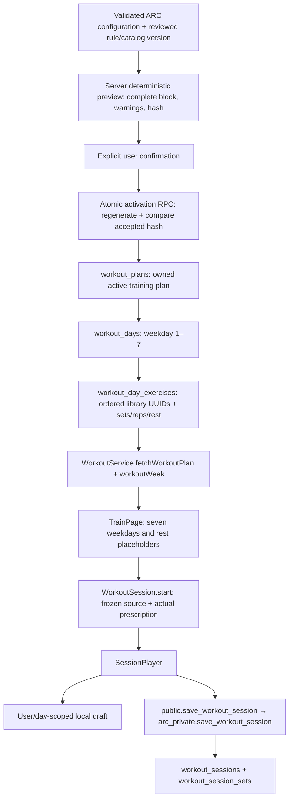

# ARC Phase 2C — Training Plan Engine Architecture Audit

Repository cleanup note (2026-10-11): this is a historical report. Disposable run evidence was removed; required test inputs, reproduction tools and the results below are retained.

> Historical handoff: the per-exercise generation approval dependency and development-preview path below are superseded by [Checkpoint 2](ARC_PHASE_2C_CHECKPOINT_2.md). The review-only SQL remains unapplied and unused; runtime candidates come from the current exercise_library.

**Audit date:** 10 October 2026, Asia/Calcutta. **Decision: BLOCKED for reliable full-body program generation; NEEDS ADAPTATION for integration.** Phase 2A/2B persistence can be reused, but catalog coverage, programming review and activation authority must be addressed first.

This is an architecture report, not Phase 2C implementation. No application code, screen, service, migration, live account, profile, exercise, mapping or plan was changed. Live access consisted of SELECT queries, metadata and public catalog inspection. Profile checks retrieved aggregate completeness only, never individual profile values. Documentation/evidence files are the only repository additions.

Repository root: `C:/Users/ivang/ARC VSCODE/Arc`. All repository paths below are relative to that root. Evidence: `docs/phase2c_readonly_database_audit.json`. Snapshot counts can change after this audit.

## 1. Verified baseline and readiness

Connected project **nbojicqbpqgotdmdayku**, ACTIVE_HEALTHY, PostgreSQL **17.6.1.166** (server setting 17.6). Remote migration history contains exactly **20261009174458 / arc_phase_2a_2b_training_variants**. The training tables, session RPC, mapping freeze trigger and relevant indexes exist. This is fresh read-only evidence, superseding older reports written before deployment.

| Finding | Classification | Reason |
| --- | --- | --- |
| Owned active training plan, weekly days, ordered prescriptions | READY | Existing tables, ownership policies and active-plan uniqueness |
| Train, SessionPlayer, local drafts and cloud history | READY | Existing consumption/snapshot path and passing regression tests |
| Multi-select front/back anatomy assets | NEEDS ADAPTATION | Reusable renderer; state mismatch, discovery coupling and non-muscle regions |
| Goal, level and days onboarding inputs | READY | Current saves validate them; existing aggregate sample has no missing values |
| Location, time, equipment, exact weekdays and safety inputs | NEEDS ADAPTATION | Some nullable fields exist; required configuration is not collected by onboarding |
| Reviewed deterministic programming rules | BLOCKED | No approved rule/template registry or reviewer acceptance evidence |
| Balanced full-body exercise coverage | BLOCKED | Missing primary targets and suitable movement/equipment coverage |
| Full-body Home generation/adaptation | BLOCKED | Ten nominal home-capability entries; zero mappings; incomplete coverage |
| Atomic, authoritative plan activation | NEEDS ADAPTATION | Unique active index exists; no activation/generation RPC; direct owner writes remain |
| Journey duration, block identity, progression records | NEEDS ADAPTATION | No explicit current plan fields; weekly schedule repeats without dates |
| Real-device hosted auth/train acceptance | BLOCKED for release acceptance | Automated tests do not resolve the earlier Android login evidence gap |

“READY” means reusable for its current responsibility, not that it establishes clinical suitability or whole-system production acceptance.

## 2. Existing architecture and files

| Responsibility | Actual files |
| --- | --- |
| Home and application shell | `lib/home_page.dart`, `lib/main.dart` |
| Anatomy page and asset delivery | `lib/anatomy_test_page.dart`, `lib/body_server.dart` |
| Clickable SVG anatomy | `assets/body_parts/index.html`, `assets/body_parts/bodyRegions.js` |
| Separate 3D viewer assets | `assets/3d_viewer/index.html`, `assets/3d_viewer/human.glb` |
| Discovery selection/filtering | `lib/focus_workout_page.dart` (`MuscleFocus`, `FocusWorkoutPage`) |
| Profile collection/read/write/validation | `lib/auth/onboarding_page.dart`, `lib/data/onboarding_answers.dart`, `lib/data/profile_service.dart`, `lib/data/profile_validation.dart`, `lib/profile_edit_page.dart` |
| Plan loading/models | `lib/data/workout_service.dart`, `lib/data/workout_models.dart` |
| Training view and player | `lib/train_page.dart`, `lib/session_player.dart` |
| Session contract/persistence | `lib/data/workout_session.dart`, `lib/data/workout_session_service.dart` |
| Home adaptation/context | `lib/data/home_workout.dart`, `lib/data/home_workout_service.dart`, `lib/data/training_context_service.dart`, `lib/widgets/training_variant_panel.dart` |
| Deployed training migration | `supabase/migrations/20261009174458_arc_phase_2a_2b_training_variants.sql` |
| Consolidated proposal and disabled seed | `docs/sql/workout_training_variants.sql`, `supabase/seeds/20261009174458_home_mapping_seed_disabled.sql` |
| Current tests | `test/workout_test.dart`, `test/workout_session_widget_test.dart`, `test/home_workout_test.dart`, `test/home_workout_widget_test.dart`, `test/profile_test.dart`, `test/auth_onboarding_test.dart`, `test/sql/phase2b_local_pg_test.py` |

There is **no implemented “Start My ARC” builder entry point**. Home exposes callback parameters, and `main.dart` wires `onStartSession` to the Train tab, but the current Home training card renders static “Upper push” information and does not invoke those callbacks. Do not treat that card as an assigned plan. Phase 2C should add its own small entry action and later reconcile training copy with activated-plan data; meal, mascot and other Home content are outside this phase.

## 3. Anatomy reuse audit

**NEEDS ADAPTATION.** The currently connected anatomy feature is an SVG fragment renderer inside WebView, served over loopback by BodyServer. The separate 3D viewer is not the implementation loaded by AnatomyTestPage. Both male/female front/back asset data exist; the UI exposes front/back toggle, defaults to male and does not expose gender selection.

JavaScript `selectedGroups` is a Set. Flutter `_selected` is a List toggled on `ArcMuscle` channel messages; multi-select and cross-view retention are supported. Clicking a fragment selects its parent group, not a left/right fragment prescription. Reset sends `__clear__`. Back navigation disposes the local server.

A confirmed state mismatch exists: JavaScript initializes chest, biceps and quadriceps as highlighted, whereas Flutter starts empty. The first click on one of those removes its highlight but adds it to Flutter's list. There is no initial selection handshake or complete-state message. A new page also starts with an empty local list while the global `MuscleFocus.selected` can retain an earlier discovery selection. That global value is neither persisted profile data nor an account-scoped plan configuration.

Discovery is reachable from Train's no-plan “Browse anatomy” button and its existing priority-image button. Anatomy currently pushes FocusWorkoutPage using a copied muscle list. FocusWorkoutPage queries published exercise_library rows and uses substring aliases against body_part, target_muscle and name, taking six matches per selected group. It displays discovery cards/GIFs; it does not create a balanced workout prescription.

Reuse the renderer through a future selection mode with explicit initial state, canonical output and a return value/callback. Retain discovery mode and its independent navigation. Builder state must be scoped to the current user, not written into the discovery notifier. Prefer a full selected-set channel message and one authoritative state model over two independently toggled lists. Whitelist permitted group IDs. Normalize before generation, never use substring discovery matching as programming logic. Validate native WebView loading, front/back, reset, first-click, cancel/reopen and failure states on Android; pure Flutter tests do not exercise the asset bridge.

| Anatomy ID | Proposed canonical target | Catalog fit / action |
| --- | --- | --- |
| chest | chest | Exact primary alias: pectorals |
| deltoids | shoulders | Exact primary alias: delts; discovery's “deltoid/shoulder” aliases miss a primary “delts” match unless name/body_part happens to help |
| forearm | forearms | Exact alias; also secondary metadata |
| gluteal | glutes | Exact alias |
| hamstring | hamstrings | No primary catalog rows |
| quadriceps | quadriceps | No primary rows; four secondary mentions are not equivalent approval |
| upper-back | upper_back | Catalog “upper back” and lats are distinct targets; don't collapse indiscriminately |
| lower-back | spinal_extensors | Catalog primary “spine”; current broad “back” discovery filter overlaps upper-back results |
| trapezius | trapezius | Secondary “traps/trapezius”; no primary rows |
| abs / obliques | abs / obliques | Preserve separate IDs; core can be a display grouping |
| biceps / triceps / calves | same IDs | Direct primary matches |
| adductors / tibialis | same IDs | No primary catalog coverage |
| neck | neck | Requires separate suitability/rule review; no primary rows |
| head, hair, hands, feet, knees, ankles | not muscle priorities | Exclude from program selection or explain unsupported regions; remain visual/discovery assets |

Do not use `home_workout.dart:muscleGroup` as the canonical ontology: it intentionally collapses back and leg groups for display. Distinct priorities and recovery accounting need finer IDs.

## 4. Profile and onboarding input audit

Live profile columns match the current ProfileRow model. Training-relevant columns are nullable; `onboarding_complete` defaults false. Current completionPatch requires the eight onboarding steps, writes verified values and marks completion together. Database completion is not proof that every desired Phase 2C input exists.

Read-only aggregate sample: two profiles, both complete; neither lacks goal/level/days or age/height/weight/gender. One has location and one has duration. This is a tiny current sample, not a guarantee for future, legacy or independently edited rows. Never substitute default gym/location/safety assumptions for missing inputs.

| Field / stored column | Collection and requirement | Reliability and generation suitability |
| --- | --- | --- |
| fitness_goal | Required onboarding step 1; profile editor; Build muscle/Lose fat/Stay consistent | Present in current completed sample; validate exact supported value and use reviewed goal templates |
| gender | Required onboarding step 2, Male/Female | Stored nullable; not a capability, clearance or default volume multiplier |
| age | Required step 3; integer 13–120; editor | Current sample present; entered age does not update with birthdays; reconfirm relevance, especially age-scope eligibility |
| date_of_birth | Model/schema only, not onboarding | Cannot assume present; ageAt prefers stored age over DOB |
| height_cm / weight_kg | Required step 4; editor; numeric validation | Present in sample; not a tested lifting capacity or medical-risk classifier |
| experience_level | Required step 5; Beginner/Intermediate/Advanced, question “How active are you?” | Present; self-description may not reflect lifting technique or training history; clarify only where eligibility needs it |
| train_days | Required step 6 offers 3/4/5/6; editor validation 1–7 | Present; frequency is not exact availability; gather weekdays without repeating the frequency question |
| diet_type / allergies | Required steps 7/8; “None” allowed as explicit allergy answer | Food information; not exercise injury/medical screening; no need to repeat for training |
| workout_location | Optional profile editor Gym/Home/Both/Outdoors; not onboarding | One current value; ask only if missing/ambiguous and validate against supported engine location |
| session_duration_minutes | Nullable schema/model; not onboarding or editable-fields whitelist | One current value; TrainingContext only retains 15 or 30 for existing adaptation; broader engine duration needs explicit validated config |
| equipment availability | Not a profile field collected by onboarding | Existing Home panel chooses bodyweight/dumbbells/bands per session; not a durable verified equipment inventory |
| user_state.injury | JSON inspected by TrainingContext | Not a validated onboarding injury history or medical clearance |
| rehab_cases status/body_region | Separate existing reports queried by TrainingContext | Signal of reported discomfort only; read as a blocker/review signal, never infer diagnosis or suitable substitutions |

Additional Phase 2C configuration should contain canonical muscle priorities, exact weekdays, available time, concrete equipment/support surfaces, supported location, ARC start/duration/timezone and a reviewed current-limitation/eligibility check. Reuse valid saved goal, level and days as defaults and ask only for missing, conflicting or stale information. “Both” and “Outdoors” require explicit support decisions; the current TrainingContext silently treats anything except Home as gym, which is unsuitable for a generator.

No structured injury screening or equipment inventory was found in onboarding. Do not invent existing fields. Newly collected safety answers require a reviewed schema, privacy/retention decision and clear restricted-use scope. Existing onboarding allows minors; healthy-adult rules cannot automatically be applied to every registered age.

## 5. Real exercise library and coverage

**BLOCKED.** The actual table is **public.exercise_library**, not exercises. Its UUID id is the FK used by workout_day_exercises. source_external_id is optional/unique and should not replace the UUID in persisted prescriptions.

All **30** rows are published, have non-empty instruction arrays, GIF paths and secondary muscle arrays. **Zero** have difficulty values or non-empty tags. There is no exercise-level approval/reviewer/version field or structured movement-pattern, contraindication, complete required-equipment or progression classification. GIF paths exist; media reachability, instructional accuracy and external licensing were not independently verified. No separate video URL field exists.

`is_published` defaults true and controls discovery visibility. It is **not professional programming approval**. The count of verified generation-approved exercises is zero because no such approval evidence is represented in the inspected system. This does not assert that no external professional has ever reviewed an exercise; it means the engine cannot verify that review.

The following matrix counts primary-target rows, not secondary contributions. Every counted row is published with instructions and a GIF reference. BW=body weight, DB=dumbbell, BB=barbell, Lever=leverage machine, KB=kettlebell. Exact category meanings are retained; “weighted” and “assisted” are not sufficient equipment specifications.

| Primary target | BW | DB | BB | Cable | Lever | Sled | Smith | KB | Assisted | Weighted | Published total | Verified generation approvals |
| --- | ---: | ---: | ---: | ---: | ---: | ---: | ---: | ---: | ---: | ---: | ---: | ---: |
| abs | 0 | 0 | 0 | 1 | 0 | 0 | 0 | 0 | 1 | 1 | 3 | 0 |
| biceps | 0 | 3 | 1 | 2 | 0 | 0 | 0 | 0 | 0 | 0 | 6 | 0 |
| calves | 0 | 0 | 2 | 0 | 0 | 1 | 0 | 0 | 0 | 0 | 3 | 0 |
| delts | 0 | 2 | 0 | 0 | 0 | 0 | 0 | 0 | 0 | 0 | 2 | 0 |
| forearms | 0 | 1 | 1 | 0 | 0 | 0 | 0 | 0 | 0 | 0 | 2 | 0 |
| glutes | 1 | 0 | 0 | 0 | 0 | 1 | 1 | 1 | 0 | 0 | 4 | 0 |
| lats | 0 | 0 | 0 | 0 | 1 | 0 | 0 | 0 | 0 | 0 | 1 | 0 |
| pectorals | 0 | 0 | 1 | 1 | 0 | 0 | 1 | 0 | 0 | 0 | 3 | 0 |
| spine | 0 | 0 | 0 | 0 | 0 | 0 | 0 | 0 | 0 | 1 | 1 | 0 |
| triceps | 1 | 2 | 1 | 0 | 0 | 0 | 0 | 0 | 0 | 0 | 4 | 0 |
| upper back | 0 | 0 | 0 | 0 | 1 | 0 | 0 | 0 | 0 | 0 | 1 | 0 |
| quadriceps | 0 | 0 | 0 | 0 | 0 | 0 | 0 | 0 | 0 | 0 | 0 | 0 |
| hamstrings | 0 | 0 | 0 | 0 | 0 | 0 | 0 | 0 | 0 | 0 | 0 | 0 |
| obliques | 0 | 0 | 0 | 0 | 0 | 0 | 0 | 0 | 0 | 0 | 0 | 0 |
| adductors | 0 | 0 | 0 | 0 | 0 | 0 | 0 | 0 | 0 | 0 | 0 | 0 |
| tibialis | 0 | 0 | 0 | 0 | 0 | 0 | 0 | 0 | 0 | 0 | 0 | 0 |
| trapezius | 0 | 0 | 0 | 0 | 0 | 0 | 0 | 0 | 0 | 0 | 0 | 0 |
| **Total** | 2 | 8 | 6 | 4 | 2 | 2 | 2 | 1 | 1 | 2 | **30** | **0 verified** |

**Structural/discovery usability:** 30 published entries. **Verified deterministic-generation eligibility:** zero. Neither a primary-target label nor instructions alone establish a safe choice for a particular user.

Home-capability-compatible primary equipment occurs on **10** rows: eight dumbbell and two body-weight entries; there are no band entries. Their primary groups are biceps, delts, forearms, triceps and glutes. No primary chest/back/quadriceps/hamstring/core/calf Home coverage exists. The body-weight rows are “impossible dips” and “bent knee lying twist (male)”; they cannot be presumed beginner staples. Bench/preacher/support and stability-ball requirements appear in names/instructions but are not modeled by the equipment string. Existing Home matching checks approved mappings, basic equipment capabilities, target and instruction presence; it does not derive a complete support-surface inventory from instructions. A new generator needs complete reviewed requirements.

Secondary hamstrings occur on seven rows and quadriceps on four; chest on two, obliques on three. Secondary text is not quantified workload or proof of usable knee-dominant/hinge coverage. Example metadata such as the glutes target for a lying twist warrants content review rather than automatic correction during this audit. No normalized movement coverage can be proved because movement_pattern is absent on library rows.

Gym generation is also blocked: more machines do not fix absent reviewed hip-hinge/knee-dominant choices, ambiguous difficulty, incomplete equipment and no verified programming rules. Do not fill gaps by inventing exercise records or silently assigning excessive volume to the few covered muscles.

Live **workout_alternative_mappings is empty**. The six repository seed rows remain separate **proposed/disabled** definitions. They were neither inserted nor approved here. Existing mapping patterns are constrained to elbow_flexion, shoulder_flexion and upright_row, covering a narrow pilot rather than full-body adaptation.

## 6. Current database compatibility and authority

| Existing object | Classification / exact meaning |
| --- | --- |
| workout_plans | READY: id, user_id FK profiles, plan_type training/rehab, name, status draft/active/archived, version, timestamps |
| one_active_plan_per_type | READY: unique partial index (user_id, plan_type) WHERE status=active; do not add a redundant unique index |
| workout_days | READY: plan FK, weekday 1–7, title, estimated_minutes, notes; unique plan/weekday |
| workout_day_exercises | READY: source UUID, day FK, library FK, unique day/sort_order; nullable sets/reps/rest/notes |
| workout_sessions / workout_session_sets | READY: owned immutable snapshots, completion flags, revisions, variant metadata, nullable historical source FKs |
| save_workout_session | READY for existing contracts: authenticated-only public invoker wrapper calls arc_private definer; both empty search_path; anon EXECUTE denied |
| mapping_definition_frozen | READY: private freeze function; reviewed/retired definition freezing preserved |
| ARC duration/priorities/block/provenance | NEEDS ADAPTATION: no explicit columns or typed config; plan name/notes are not durable lifecycle data |
| Server generation/preview/activation function | NEEDS ADAPTATION: not present in inspected routines |

The existing plan tables have owner-scoped ALL policies, and anon/authenticated have broad table grants. RLS restricts normal row operations to owners and published catalog reads, but **ownership is not programming validation**. An authenticated client can insert/change its own days, prescriptions and plan status. The session RPC verifies saved source consistency and approved Home mappings; it does not independently certify the program written into source plan rows.

For Phase 2C, reviewed programs need server-only creation/mutation authority. Propose narrowing plan/day/exercise direct write privileges and policies to the actual approved ownership/read model and admitting writes through narrowly scoped validated RPCs. Audit external admin/import dependencies before those changes. Do not blanket-revoke privileges on mixed training/rehab tables or alter Rehab behavior without a separate dependency-compatible design.

Observed legacy grants also include TRUNCATE/REFERENCES/TRIGGER on these tables and exercise_library for client roles. TRUNCATE is not row-filtered by RLS. This audit did not invoke it; ordinary PostgREST row endpoints do not expose arbitrary SQL TRUNCATE. It is nevertheless excessive database privilege and needs separately reviewed hardening alongside RPC authority, not a claim that anon REST can currently erase the library.

New activation must be one database transaction: authenticate with auth.uid(), require a completed eligible profile, validate authoritative configuration/reviewed manifests, lock a stable per-user activation resource, check expected current active-plan ID/version, handle idempotency, create all plan/day/prescription rows, archive only that user's previous **training** plan, activate the complete replacement and return identifiers. Any validation or insertion failure rolls everything back. The existing unique active index is a final concurrency backstop, not a substitute for transaction ordering and expected-version checks.

Do not accept a client-supplied owner ID, trusted approval flag or arbitrary exercise/set JSON as proof of review. Supabase recommends controlled execution privileges and an explicitly secured search_path for definer functions; the existing session wrapper demonstrates that pattern. [Supabase database functions](https://supabase.com/docs/guides/database/functions), [RLS guidance](https://supabase.com/docs/guides/database/postgres/row-level-security).

## 7. Exact integration path and Phase 2A/2B incompatibilities

WorkoutService chooses active training plan for current user, then selects `workout_days(*, workout_day_exercises(*, exercise_library(*)))`, sorts exercise sort_order, and fills missing weekdays with explicit client-side Rest Day placeholders. Train chooses today's weekday using device local time. SessionPlayer consumes WorkoutSession, not an unpersisted generated draft. Move.id is **workout_day_exercises.id**, while exerciseId is **exercise_library.id**; preserve this distinction.

Sets/reps/rest are nullable today and the UI labels missing prescriptions, tracking one set/no timer. Generation must supply explicit reviewed values, not rely on those compatibility defaults. Estimates belong in workout_days. Existing storage supports free-text reps; typed repetition/time/load semantics should remain structured in reviewed rule/config metadata and render compatible display text.

First session registration requires an **active owned training** source plan/day and matching source snapshot. Gym must preserve its original prescription; Home requires approved enabled mapping IDs/versions, matching target/metadata and supported equipment. Existing registered sessions can continue after catalog/mapping/plan edits without revalidating their original snapshot; revisions, terminal states and idempotent retries remain enforced.

**Replacement/history rules:** archive old plans; do not mutate prior source prescriptions or delete rows to replace a plan. Plan/day deletion cascades to day/prescription definitions but historical session FKs use SET NULL and snapshots survive. Keep old definitions for clarity and resumability. Registered cloud sessions can still progress after archiving. An offline draft never registered before replacement cannot first-register against an archived plan; the current snapshot contract deliberately rejects it. Require pending draft synchronization and explicit resolution before replacement, and coordinate activation with per-user/day registration locks where necessary. The existing RPC uses a user/day advisory lock, not the proposed activation lock; concurrency tests must cover this race. Cross-device offline drafts cannot be known perfectly by the server, so provide a recovery policy rather than promising otherwise.

**Home incompatibility:** putting home exercises in workout_day_exercises alone is not enough. WorkoutSession.start labels unadapted sessions gym_original, regardless of nominal library equipment, and home_curated requires a mapping for every selected exercise. A native Home program therefore needs a separately designed, approved contract/variant; do not relabel it gym_original or bypass mappings. The smallest first increment is Gym-only. Extending full-body Gym/Home adaptation requires reviewed mappings, expanded movement constraints and coordinated Flutter/RPC tests.

**Time/block incompatibility:** current weekday tables express one recurring week, not dated workouts, multiple weekly patterns or journey expiry. Train does not enforce start/end dates or automatically switch blocks. Use one stable weekly block initially and make future block/expiry loading explicit before promising duration-based lifecycle behavior.

**Refresh incompatibility:** Train reloads on auth events or its Refresh button, not a plan-activation signal. Because the shell keeps tab state, activation needs a small explicit plan invalidation/load hook; simply switching tabs will not guarantee fresh data.

## 8. Deterministic engine requirements, not an algorithm implementation

Established healthy-adult guidance favors regular resistance training involving all major muscle groups and gradual, individualized progression. WHO recommends muscle strengthening on at least two days weekly; current ACSM guidance emphasizes consistency and goal-dependent volume/load rather than unnecessary complexity. These are broad principles, not a universal ARC prescription or injury-clearance standard. [WHO activity guidance](https://www.who.int/initiatives/behealthy/physical-activity), [ACSM 2026 guidance](https://acsm.org/resistance-training-guidelines-update-2026/).

The product rules below are **proposals requiring programming review**, not medically validated constants:

| Requirement | Minimum reviewed rule/data needed | Classification |
| --- | --- | --- |
| Split selection | Supported-day templates; 2/3-day full-body and 4-day upper/lower are candidate product choices, not mandatory physiology rules. Defer 5/6-day specialization initially | BLOCKED pending rule review |
| Priority emphasis | Balanced baseline first, bounded priority adjustment within reviewed weekly/session limits; fewer priorities when time is limited; count compound overlap without arbitrary secondary-set multipliers | BLOCKED pending reviewed budgets |
| Exercise selection | Exact UUID allowlist, canonical muscles/patterns, complete equipment, skill eligibility, excluded conditions, deterministic score and stable tie-break | BLOCKED pending catalog review/coverage |
| Prescription | Reviewed goal/experience-specific sets, repetition/time unit, rest, effort guidance and allowed limits; every generated move explicit | BLOCKED pending reviewed templates |
| Time feasibility | Warm-up, setup/transitions, work and rest costs; solve within user time or return a conflict, not silently remove necessary training | NEEDS ADAPTATION |
| Recovery/frequency | Check chosen weekday spacing including Sunday→Monday; apply reviewed movement/muscle recovery rules and total-load bounds | BLOCKED pending reviewed scheduling rules |
| Experience | Conservative supported beginner skill set; separate intermediate/advanced eligibility; self-label is not permission for difficult movements | BLOCKED pending classifications |
| Equipment | Require all tools/support surfaces for each exercise; no assumed gym inventory or substitutions from name similarity | BLOCKED pending metadata |
| Limitations | Reviewed eligibility/safety questionnaire; reported discomfort or unsupported conditions trigger review/restriction, not diagnosis or Home reassurance | BLOCKED pending scope/review |
| Progression | Initially reviewed guidance for next sessions/block; no automatic weight/volume increase inferred from completion ticks alone | NEEDS ADAPTATION |
| Insufficient coverage | Return named missing patterns/targets/equipment and no activatable program; never invent exercises or pad accessories | READY as requirement |
| Unrealistic preferences | Explain conflict and ask for a feasible day/time/priority change; never auto-increase days, effort or volume | READY as requirement |

The current player persists completion flags; schema includes recorded_reps and weight_kg, but the current save RPC inserts/updates flags, not those performance measurements. True performance-driven progressive overload therefore needs collection, snapshot/update semantics and tests before automation. ARC duration should identify an overall journey, with an explicitly reviewed shorter block and a review point; exact journey options, block length and expiry behavior remain product decisions.

The “complete program” preview must clearly show the whole journey's duration, block structure, schedule assumptions and review points, plus every prescribed workout in the currently generated block. Future blocks that depend on a later review must be labeled as not yet prescribed. If the product instead promises every future workout at initial confirmation, the minimal recurring-block model is insufficient and needs a different dated schedule design before implementation.

## 9. Proposed smallest architecture and genuinely necessary data

**All component names here are proposed, not existing files or services.**

Flutter owns entry/navigation, fetching current user inputs, local builder state, anatomy selection, missing-input forms, preview display, explicit confirmation and invoking server operations. Supabase owns auth/ownership checks, reviewed rule/catalog access, authoritative generation/validation, atomic writes, active-plan concurrency and idempotency. No LLM, RAG or new AI dependency is needed.

For minimal deterministic authority, use one server generation implementation backed by reviewed versioned templates/allowlists. A read-only preview RPC returns canonical configuration, planned ordered UUID prescriptions, coverage/timing explanations, review/version provenance and a digest without creating a plan. Activation uses the same generator, verifies the accepted digest and expected active plan, and writes atomically. If profile, catalog or rules changed after preview, return a fresh preview for confirmation rather than silently activating a different program. A signed proposal token is optional; it does not replace regeneration/authorization. Avoid duplicating prescription logic independently in Flutter and SQL.

Recommended proposed structures:

- **TrainingConfig:** normalized relevant profile snapshot, canonical priorities, exact weekdays, location, complete equipment, minutes, eligibility result, journey start/duration/timezone. Versioned and validated.
- **ReviewedRuleManifest:** goal/experience/schedule scope, approved template prescriptions, recovery/volume/time limits, reviewer/version/retirement state.
- **ReviewedCatalogManifest:** exact exercise UUID + metadata digest/version, canonical primary/secondary muscles, movement pattern, equipment/support, skill level, restrictions, generation eligibility. Store server-owned and link to real library rows; missing rules stay unsupported.
- **GeneratedPreview:** configuration/rules/catalog digests, complete current-block schedule, future block review points, priority explanation, conflicts and activation eligibility.
- **ActivationReceipt:** idempotency key, request digest, resulting plan UUID/version and expected previous active plan. Reusing a key with another request must fail.

Necessary changes, to propose in a later reviewed migration:

1. Retain the three plan tables and existing active uniqueness. Add validated training configuration/provenance and journey/block start/end state to plans (or a single one-to-one training metadata table if mixed rehab compatibility warrants it). Do not repurpose profile user_state or plan notes for lifecycle authority.
2. Add durable activation request ID/digest/result uniqueness. A unique plan activation_request_id plus request_digest may suffice if activation always creates one immutable plan; a separate operation table is only needed for richer retry/result retention.
3. Add a server-owned reviewed rule/catalog manifest representation. It can begin as a compact versioned allowlist/template registry; do not introduce an elaborate exercise ontology or broad new platform tables without need.
4. Add preview and activation RPCs with explicit ACLs, ownership validation, transaction/lock/conflict behavior; close direct training prescription bypasses while preserving separately audited admin/Rehab dependencies.
5. Add block/date-aware loading and activation invalidation only where required by the accepted duration promise. Multiple future dated schedules need their own model later; a plan/weekdays unique constraint cannot represent all weeks.
6. Do not change session tables/RPC for Gym-only activation. Native Home generation or richer progression are separate reviewed follow-ups with migrations/contracts only if accepted.

A dedicated ARC journey table is **not mandatory** for one journey represented by successive training blocks if provenance/lifecycle metadata can link them. Revisit it only when concurrent journeys, cross-domain goals or explicit journey history become actual requirements.

## 10. Verification and staged delivery

| Executed check | Result / limit |
| --- | --- |
| Fresh project/schema/constraints/indexes/policies/grants/routine metadata | PASS, SELECT only; current deployment confirmed |
| Raw public library coverage and aggregate profile completeness | PASS, counts retained in evidence; no approval fabricated |
| Full Flutter suite | PASS **83/83**; existing behavior contracts, not real-device hosted acceptance |
| Flutter analyzer | Zero errors, **15 warnings + 72 infos**, unchanged baseline; analyzer command exits 1 |
| Disposable PostgreSQL schema + separate disabled seed + RPC/RLS/ownership/retries/variants/history tests | PASS on fresh independent **PostgreSQL 18** at 127.0.0.1:55439; synthetic identities only |
| Target PostgreSQL 17/hosted generator/activation verification | NOT RUN; no Phase 2C code exists and no live writes authorized |
| Working-tree whitespace | PASS |
| Real Android anatomy bridge, generated-plan UX and existing-account login | NOT VERIFIED |

The previous disposable cluster was missing pg_notify and failed to start. It was not repaired. A freshly initialized separate temporary cluster ran the existing test harness against the preserved migration and disabled seed, then was stopped; successful synthetic fixture database cleanup is handled by the harness. Seed execution was local only and retained proposed/disabled status.

Implementation should start **only after this report is reviewed**:

1. **Content/rule readiness:** agree supported adult cohort, initial goal/experience/location/day scope; professionally review a real full-body catalog subset, complete metadata and programming templates. Acceptance: every required slot has eligible real UUID candidates and feasible scheduling/timing; no invented exercises/approvals.
2. **Authority/persistence design:** review schema additions, direct-write dependency hardening, idempotent activation, preview consistency and replacement/offline policy. Build/test on disposable PostgreSQL 17 or staging, never use production to discover transaction failures.
3. **Independent builder UX:** add Home entry, synchronized anatomy selection mode and only missing configuration inputs; preserve Browse Anatomy and current UI. Tests cover cancellation, multi-select, unsupported groups, no profile duplication, state isolation/account switching.
4. **Read-only preview engine:** deterministic replay tests, stable tie-breaks, catalog/rule version invalidation, balanced coverage, priorities not exclusivity, cyclic recovery, time bounds, unsupported equipment/age/limitations and impossible-preference failures.
5. **Explicit activation:** tests for cross-owner/anon/forged payloads, direct-table bypass prevention, competing activations, duplicate/lost-response retries, failure halfway through inserts, expected-plan conflicts and active-index preservation. Include mixed rehab dependencies without changing them.
6. **Train/history handoff:** existing contract round-trip tests using persisted prescription UUIDs; activation refresh, dates/rest days, registered history preservation and unregistered draft replacement races. Manually verify real-device auth→builder→preview→confirm→Train→player→history→reopen before release.
7. **Later expansion:** advanced/high-frequency programs, additional goals, Home/native Home contracts, reviewed mapping breadth and measured progressive overload only after their specific gates pass.

Outstanding product decisions: supported ages/conditions and safety review process; maximum priority count; first goal/experience/day variants; journey durations and block review cadence; date/timezone semantics; how users resolve unavailable catalog/time preferences; admin import/write dependencies; offline replacement recovery; review authority/version retirement; media validation/licensing.

## Recommendation

The smallest useful Phase 2C is **a reviewed, Gym-only, healthy-adult beginner training block with a stable supported weekly schedule**, prefilled onboarding data, a small bounded set of muscle priorities, missing-input configuration, a complete server-generated preview and explicit atomic activation into the existing plan tables. For example, one reviewed three-day template could be the initial scope because onboarding already offers three days; its exact prescriptions and block length still require reviewer/product acceptance. Other preferences must be visibly unsupported or require an explicit user-approved change, never silently coerced.

**Do not build a pretend full-body program from the present 30-entry catalog.** First resolve exercise/programming coverage and authority gates. Then reuse Train, SessionPlayer and Phase 2A history intact, with focused refresh/lifecycle integration. Full-body Home generation remains blocked until real reviewed catalog/mapping coverage and a compatible session contract exist.

